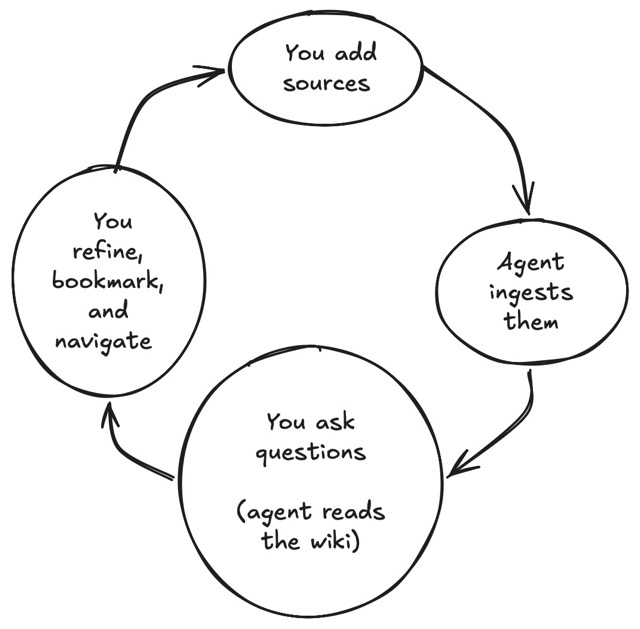

# Self-Driving Wiki — User Guide

**Self-Driving Wiki** is a native macOS app that combines a personal wiki with
an AI agent. You collect source material — PDFs, web pages, podcast episodes,
markdown notes — and the agent reads, digests, and organizes them into a
connected knowledge base of wiki pages. You ask questions, the agent answers
from (and updates) the wiki, and everything stays linked and searchable.

This guide covers **what you see and what you can do** — the interface, the
workflows, and the mental model. It does not cover internals or architecture.

---

## Core concepts

| Concept | What it means to you |
|---|---|
| **[Wiki](user-guide/organizing-and-managing.md#multiple-wikis)** | A self-contained knowledge base. You can have many — a personal one, a research project, a per-book study guide. Each lives in its own window and has its own pages, sources, and chat history. |
| **[Page](user-guide/pages-and-links.md)** | A wiki page written in Markdown. Pages are the curated output — summaries, entity profiles, concept explanations, indexes. The agent writes most of them; you can edit any of them. |
| **[Source](user-guide/sources-and-ingestion.md)** | Raw material you bring into the wiki: a dropped PDF, a fetched web page, a Zotero attachment, an imported markdown folder. Sources are the input the agent digests into pages. |
| **[Agent](user-guide/chat.md)** | The AI that maintains the wiki. It can **Ingest** sources into pages, answer questions in **Chat**, clean up formatting with **Lint**, and more. You interact with it conversationally. |
| **[Wiki link](user-guide/pages-and-links.md#wiki-links--the-connective-tissue)** | The connective tissue. `[[Page Name]]` links pages to each other; `[[source:Name]]` links pages to sources. `[[chat:Name]]` links to past chats with the agent. Links are how the knowledge base stays connected and navigable. |
| **[Bookmark](user-guide/organizing-and-managing.md#bookmarks)** | A user-defined shortcut to a page, source, or chat, organized into folders. Your personal table of contents. |

### The fundamental workflow

1. **[Collect](user-guide/sources-and-ingestion.md#adding-sources)** — Drag in PDFs, paste URLs, import from Zotero, or drop a folder of notes.
2. **[Ingest](user-guide/sources-and-ingestion.md#ingestion)** — Tell the agent to process sources. It reads them, extracts key information, and writes pages with cross-references.
3. **[Explore](user-guide/pages-and-links.md)** — Browse pages, follow wiki links, search semantically, bookmark what matters.
4. **[Ask](user-guide/chat.md)** — Chat with the agent about the wiki's contents. Ask it to update pages, add cross-references, or explain a concept.
5. **[Maintain](user-guide/organizing-and-managing.md#the-change-log)** — Run Lint to clean up formatting. Re-ingest when sources are updated. The agent keeps `index.md` and `log.md` current.

---

## Table of contents

| Page | What you'll learn |
|---|---|
| [**Getting Started**](user-guide/getting-started.md) | Create your first wiki, set up the agent, add sources, run your first ingest, ask your first question. |
| [**Interface Tour**](user-guide/interface.md) | The main window: sidebar sections, tab bar, toolbar omnibox, wiki switcher, detail pane, drop zones. |
| [**Pages & Links**](user-guide/pages-and-links.md) | Reading and editing pages, wiki link syntax, anchors and quotes, ghost links, outlines, zoom, find-on-page. |
| [**Sources & Ingestion**](user-guide/sources-and-ingestion.md) | Adding sources (drag-drop, URL, Zotero, folder import), PDF extraction, the source detail view, versioning, the ingest operation. |
| [**Chatting with the Agent**](user-guide/chat.md) | Starting chats, the composer, adding context, permission approvals, reading the transcript, chat history. |
| [**Organizing & Managing**](user-guide/organizing-and-managing.md) | Bookmarks, semantic search, navigation, multiple wikis and windows, settings, the activity queue, notifications. |
| [**Keyboard Shortcuts**](user-guide/keyboard-shortcuts.md) | A complete quick-reference card. |

---

## Design philosophy

- **The agent maintains the wiki; you curate.** Pages are reader-first by default. The agent writes and updates content; you edit when you want to correct or guide. You don't have to hand-author every page.
- **Everything is linked.** Wiki links connect pages to pages, pages to sources, and even to specific passages inside documents. The knowledge base is a graph, not a pile of files.
- **Read-only filesystem, read/write database.** The wiki can optionally appear as a read-only folder in Finder (the File Provider mount), but all edits happen in the app or through the agent. This keeps the data consistent.
- **Native macOS feel.** Tabs like Safari, an omnibox like Safari, a sidebar like Xcode, bookmarks like a browser. If you know macOS, you know the basics.
