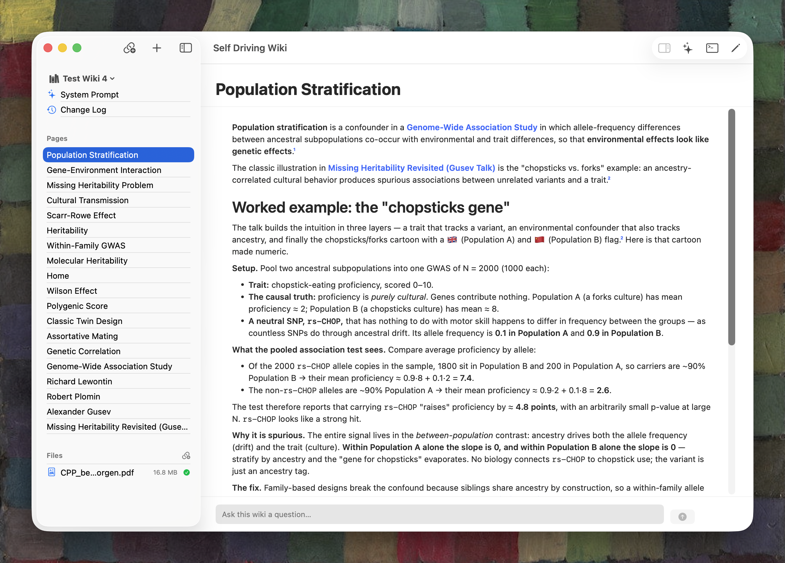

# Self Driving Wiki



A native macOS app that turns a pile of sources — PDFs, web pages, podcast
episodes, your own notes — into a **connected knowledge base** that an AI agent
maintains for you. You bring in the material; the agent reads it, writes wiki
pages, cross-references everything with links, and keeps it all organized. You
ask questions in plain language and get answers grounded in your own library.

It runs **locally on your Mac**. Your data stays in a SQLite file you own.

---

## What you can do with it

### 📥 Collect sources

Drag in a PDF. Paste a web link. Import your Zotero library or an entire Obsidian
vault. Drop a folder of markdown notes. Sources are the raw material — whatever
you're studying, researching, or trying to make sense of.

### 🤖 Let the agent do the bookkeeping

Point the agent at your sources and it **ingests** them: reads each one, extracts
the key information, and writes wiki pages — summaries, entity profiles, concept
explanations — all cross-referenced with `[[wiki links]]`. For large PDFs, it
fans out to parallel sub-agents to digest the bulk, then a lead agent decides
what belongs and writes everything.

### 💬 Ask questions

Open a chat and ask anything: *"What are the main differences between these two
papers?"* or *"Create a page comparing the evaluation metrics across my
sources."* The agent reads your wiki to answer. Ask it to update pages, add
cross-references, or explain a concept — it can modify the wiki when you ask it
to.

### 🔗 Follow the connections

Every page links to every other page, to sources, and even to **specific
passages** inside documents. A link like `[[source:Paper#"the results show a 30%
improvement"]]` takes you straight to the highlighted quote in the PDF. Ghost
links (red) mark pages that don't exist yet — spots where the wiki could grow.

### 🔖 Bookmark and navigate

Bookmark your go-to pages into folders. Search semantically — type "neural
networks" and find pages about "deep learning." Use the Safari-style omnibox
(⌘L) for instant navigation. Open multiple wikis in separate windows.

---

## The mental model

```
  You add sources ──► Agent ingests them ──► Pages appear in the wiki
       │                                            │
       │              You ask questions ◄──────────┤  (agent reads the wiki)
       │                                            │
       └── You refine, bookmark, and navigate ◄─────┘
```

| Concept | What it means |
|---|---|
| **Wiki** | A self-contained knowledge base. Have many — one per project, book, or research area. Each opens in its own window. |
| **Page** | A Markdown wiki page — the curated output. The agent writes most; you edit any. |
| **Source** | Raw material: a PDF, web page, podcast, or note file. The input the agent digests into pages. |
| **Agent** | The AI that maintains the wiki. It ingests sources into pages, answers questions in chat, and cleans up formatting. |
| **Wiki link** | `[[Like This]]` — the connective tissue. Links connect pages, sources, and specific passages. |
| **Bookmark** | Your personal folder tree of shortcuts to pages, sources, and chats. |

---

## A quick tour of the interface

The window follows familiar macOS patterns — tabs like Safari, a sidebar like
Xcode, an omnibox like a browser.

- **Sidebar** (left) — four sections: **Pages**, **Sources**, **Bookmarks**,
  **Chats**. Each has a search bar and action buttons.
- **Tab strip** (top of detail) — open multiple pages, sources, and chats in
  tabs. Switch with ⌘1–9, close with ⌘W, reopen with ⌘⇧T.
- **Omnibox** (toolbar) — shows the current page as `[[Title]]` when idle;
  becomes a semantic search field when you click or press ⌘L.
- **Wiki switcher** (toolbar, right) — switch between wikis. Click to open in a
  new window; option-click to switch in place.
- **Menu bar item** — monitors agent work in the background. Fills in while
  processing; shows queue status on hover.

---

## The workflow in practice

1. **Create a wiki** — name it after your project or research area.
2. **Add sources** — drag in PDFs, paste URLs, import from Zotero or a notes
   folder.
3. **Ingest** — select sources → right-click → Ingest. The agent reads them and
   writes pages. Monitor progress in the menu bar or the Agent Queue window (⌘I).
4. **Explore** — browse the generated pages, follow wiki links, search
   semantically, bookmark what matters.
5. **Ask** — chat with the agent about the content. Have it create comparison
   pages, fill gaps, or update existing pages.
6. **Maintain** — run Lint to clean up formatting. Re-ingest when sources are
   updated. The agent keeps `index.md` and `log.md` current automatically.

---

## User guide

For the full experience — every feature, every workflow, every shortcut:

| Guide | What you'll learn |
|---|---|
| [**Getting Started**](docs/user-guide/getting-started.md) | Create your first wiki, set up the agent, add sources, run your first ingest. |
| [**Interface Tour**](docs/user-guide/interface.md) | The main window: sidebar, tabs, toolbar, omnibox, wiki switcher, menu bar. |
| [**Pages & Links**](docs/user-guide/pages-and-links.md) | Reading and editing pages, wiki link syntax, anchors and quotes, zoom, find. |
| [**Sources & Ingestion**](docs/user-guide/sources-and-ingestion.md) | Adding sources, PDF extraction, the source detail view, versioning, the queue. |
| [**Chatting with the Agent**](docs/user-guide/chat.md) | Starting chats, adding context, permission approvals, reading the transcript. |
| [**Organizing & Managing**](docs/user-guide/organizing-and-managing.md) | Bookmarks, search, navigation, multiple wikis, settings, notifications. |
| [**Keyboard Shortcuts**](docs/user-guide/keyboard-shortcuts.md) | Complete quick-reference card. |

---

## Build & install

Self Driving Wiki runs **locally only** — free local dev signing, no Developer ID
or notarization needed to build and run yourself.

### Prerequisites

- **macOS 14+** (developed on macOS 26).
- A **Swift 6 toolchain** — Xcode from the App Store or the swift.org toolchain.
  No `.xcodeproj` — the build is `swift build` + [`build.sh`](build.sh).
- An **AI agent** on your PATH (e.g., `claude`). The app preflights this and
  shows a clear error if it's missing.
- For the **optional File Provider mount** (Finder integration): an Apple
  Development certificate + App Group + File Provider profiles under `signing/`.
  Without these, the app works fine but the Finder folder doesn't appear. See
  [`plans/signing.md`](plans/signing.md).

### Build & run

```sh
make            # debug build → build/Self Driving Wiki.app
make run        # install to /Applications, register File Provider, open the app
make install    # copy to /Applications and register LaunchServices + File Provider
make check      # compile-only gate (CI / agent verification)
make test       # run the test suite
make help       # every target
```

### Runtime notes

1. **Install to `/Applications`.** macOS only discovers File Provider extensions
   from apps in `/Applications`. Running from `build/` won't register the mount.
2. **Enable the domain.** A third-party File Provider must be toggled on in
   System Settings before its folder appears in Finder.
3. **TCC prompt on first launch.** A Transparency/Consent prompt may block the
   extension until you grant it.
4. **Read-after-write lag (~5s).** The Finder folder lags the database by a few
   seconds after a write — it self-heals. The agent always reads the database
   directly, so this only affects Finder browsing.

> The File Provider mount is **optional**. The app, the agent, and all features
> work without it — it exists for Finder browsing convenience.

---

## For developers & contributors

<details>
<summary>Architecture, repo layout, and contributing notes</summary>

### The non-negotiable invariant

> **SQLite is the source of truth. The File Provider mount is READ-ONLY and
> optional. Both reads and writes go through `wikictl` (DB-direct). Never make
> the mount writable.**

This is the whole point of the proof-of-concept. Making the mount writable
would dissolve the invariant the project exists to demonstrate.

```
  agent ──reads──>  wikictl  ──reads──>  SQLite (App Group DB)
         │                                              │ (optional read-only projection)
         └──writes──>  wikictl  ──writes──>  SQLite  ──projects──>  File Provider mount
```

### Repo layout (5 SwiftPM targets)

| Target | Purpose |
|---|---|
| **`WikiFSCore`** | Dependency-free core: data model, SQLite store, multi-wiki registry, agent operation seams, URL ingest + HTML→Markdown. |
| **`WikiFS`** | The SwiftUI app — editor/viewer, wiki switcher, operations, domain registration. |
| **`WikiFSFileProvider`** | File Provider extension — read-only SQLite→filesystem projection. |
| **`WikiCtlCore`** | `wikictl`'s logic (arg parsing, dispatch, wiki resolution). Unit-testable. |
| **`wikictl`** | The agent's write path CLI. |

Test target: `WikiFSTests` (`Tests/WikiFSTests/`).

### Where to look

- **Schema + migrations:** `Sources/WikiFSCore/SQLiteWikiStore.swift`
- **Multi-wiki:** `WikiRegistry.swift` / `WikiDescriptor.swift` / `WikiRegistryClient.swift`
- **File Provider projection:** `Sources/WikiFSFileProvider/Projection.swift`
- **Agent operations:** `AgentLauncher.swift` / `AgentOperationRunner.swift` / `GenerationGate.swift`
- **Write path + change bridge:** `wikictl/main.swift`, `WikiFSCore/PageUpsert.swift`, `WikiFS/WikiChangeBridge.swift`
- **URL ingest:** `URLIngestService.swift`, `HTMLToMarkdown.swift`

### Contributing

- **Dependency-free by default.** Hand-wrapped SQLite, hand-rolled HTML→Markdown.
- **Pure-core / thin-app split.** Logic in `WikiFSCore` / `WikiCtlCore` for unit testing.
- **Run `make test` before pushing.**
- **Follow [`SWIFTUI-RULES.md`](SWIFTUI-RULES.md).**
- **Never merge to `main` yourself** ([`CLAUDE.md`](CLAUDE.md)).

### Deep design docs

- [`PLAN.md`](PLAN.md) — master index + milestone status
- [`PROGRESS.md`](PROGRESS.md) — running build log, newest first
- [`plans/architecture.md`](plans/architecture.md) — system map
- [`ISSUES.md`](ISSUES.md) — known limitations
- [`SWIFTUI-RULES.md`](SWIFTUI-RULES.md) + [`CLAUDE.md`](CLAUDE.md) — coding rules

</details>
