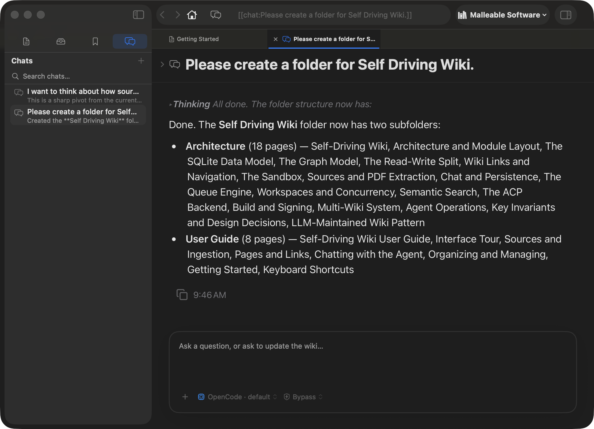

# Chatting with the Agent

The chat interface lets you converse with the AI agent about your wiki's
contents. Ask questions, request updates, explore connections — the agent reads
the wiki to answer and can modify it when you ask.

---

## Starting a chat

1. Switch to the **Chats** section in the sidebar.
2. Click the **+** button to start a new chat.
3. A new chat tab opens with an empty transcript.

Alternatively, type in the **omnibox** (⌘L to focus) and select the "Ask" action
to start a chat with your query pre-filled.

Every chat is a **persistent session** — the agent remembers the full
conversation. You can close the tab and come back later; the history is
preserved in the database.

---

## The chat interface



### Message layout

- **Your messages** appear as gray capsules on the right (max 760px wide).
- **Agent responses** appear as full-width Markdown prose on the left — no
  bubble, just readable text.
- The entire transcript renders in a single WebKit view, so you can
  **select and copy text across multiple messages** (⌘A selects everything).

### The composer

The input box at the bottom is a rounded rectangle with:

- **Text area** — type your message. Placeholder reads: *"Ask a question, or ask
  to update the wiki…"*
- **+ button** — opens the **Add Context** picker (see below).
- **Provider chip** — shows which AI model will respond. Click to change.
- **Permission chip** — shows the current permission mode (Bypass or Always Ask).
- **Send button** — green circle with an up-arrow. Appears only when there's
  text. Press **⌘⏎** to send.

---

## Adding context (attachments)

You can attach wiki content to your message so the agent has it immediately:

### Drag and drop

Drag any page, source, or chat from the sidebar directly onto the composer. The
item appears as a **chip** above the text area.

### The Add Context picker

Click the **+** button in the composer toolbar to open a searchable picker.
Select pages, sources, or chats to attach.

### How attachments work

Attachments are converted to wiki links and prepended to your message:
- A page becomes `[[page:Page Title]]`
- A source becomes `[[source: Source Name]]`
- A chat becomes `[[chat: Chat Title]]`

The agent sees these as context and can reference them. Remove an attachment by
clicking the **×** on its chip.

---

## What the agent can do

The agent has full access to your wiki through `wikictl` (the write CLI). It can:

- **Read** any page, source, or chat.
- **Write** new pages or update existing ones.
- **Create wiki links** between pages.
- **Append to the log** (`log.md`).
- **Update the index** (`index.md`).

By default, the agent **answers in chat** without modifying the wiki. It only
makes changes when you explicitly ask — e.g., *"Create a page summarizing the
key themes across these sources"* or *"Add a cross-reference from the Methods
page to the Results section."*

---

## Permission approvals

When the agent wants to modify the wiki and you're in **Always Ask** mode, an
**approval card** appears inline — between the transcript and the composer:

```
┌─────────────────────────────────────────────┐
│  ☑ Edit file                                 │
│  pages/methods.md — updating cross-reference │
│                          [Approve] [Reject]  │
└─────────────────────────────────────────────┘
```

- **Approve** — lets the action proceed. The agent continues working.
- **Reject** — denies the action. The agent adapts.
- The composer is disabled until you decide.
- The caption reads: *"The agent is waiting for your approval to proceed."*

In **Bypass** mode, the agent proceeds without asking — useful for trusted,
autonomous workflows.

Change the mode anytime via the **Permission chip** in the composer toolbar.

---

## Reading the transcript

### Agent responses

Agent messages render as full Markdown:
- **Headings, lists, tables, code blocks** — all formatted.
- **Wiki links** — `[[Page]]` and `[[source:Name]]` are clickable and navigate
  within the app.
- **Embedded media** — `![[source:...]]` renders inline.
- **Copy button** — hover over any agent response to reveal a copy icon (top-right).
  Click to copy the raw Markdown. The icon flashes green for 1.5s to confirm.

### Tool calls

When the agent uses tools (reading pages, writing files), you see compact
progress rows:
- Shown as muted, one-line indicators: `wikictl page get` + a brief summary.
- Click the **disclosure triangle** to expand full details.
- Errors appear in red.
- Toggle **Hide tool calls** (in the Activity menu) to filter these out.

### Thinking blocks

Some models show reasoning steps:
- Rendered as dimmed, italic, collapsible boxes labeled "Thinking."
- The preview shows the first line; click to expand the full reasoning.

### Duration and timestamps

After each agent response completes:
- A **"Worked for Xs"** footer appears below the response.
- **Hover** the footer to swap it to the completion timestamp (e.g., "2:34 PM").

### While generating

- A **"Thinking… [elapsed]"** indicator pulses below the transcript.
- The **Activity menu** (⋯ icon) appears with options:
  - **Show internals** — reveals the raw event feed (tool calls, diagnostics).
  - **Hide tool calls** — filters tool-call rows.
  - **Exit status** — shows "Ended" or "Exited N" when the process finishes.
  - **Reveal Log** — opens the raw log file in Finder.

---

## The chat outline

Click the **outline toggle** (sidebar.right icon) in the chat header to open a
trailing panel:

- Lists each **question → response summary** pair.
- Each entry shows your question and a one-line excerpt of the agent's response.
- Click an entry to **scroll the transcript** to that message.
- Drag the divider to resize (60–600pt).

The outline is your **table of contents** for long conversations.

---

## Managing chat history

### The Chats sidebar

- **Search bar** — hybrid full-text + semantic search across chat titles and content.
- **Recent chats** — sorted most-recent-first.
- Each row shows:
  - **Chat title** (primary line).
  - **Live indicator** — pulsing dot + "responding…" when active.
  - **Summary** — one-line extract of the first agent response (when not live).
  - **Date** — relative timestamp.

### Chat row actions

- **Click** — open the chat.
- **Right-click** — context menu:
  - **Rename Chat…** — edit the title.
  - **Delete Chat** — remove permanently (destructive).
- **Drag** — chats can be dragged as attachments into other chat composers.

### Chat header actions

| Button | What it does |
|---|---|
| **Show in List** | Scrolls the sidebar to reveal this chat. |
| **Share** | System share sheet with the chat file URL. |
| **Reveal in Finder** | Opens Finder to the chat file. |

---

## Chat summaries

When a chat completes, a **one-line summary** is automatically extracted from
the agent's first response and persisted. This summary appears:

- Under the chat title in the sidebar (when not live).
- In the chat outline as response excerpts.

The summary is generated deterministically (first sentence extract) — no
additional LLM call — so it's available instantly when the history list loads.

---

## Tips for effective chats

- **Be specific.** *"Summarize the methodology section of the Smith 2024 paper"*
  is better than *"What's in my sources?"*
- **Use attachments.** Drag in the pages or sources you want the agent to focus
  on. This gives it immediate context without searching.
- **Ask for updates.** *"Create a page comparing the evaluation metrics across
  these three papers"* — the agent will write the page and link it.
- **Reference by name.** *"What does the Neural Networks page say about
  backpropagation?"* — the agent can look up any page by title.
- **Iterate.** If the agent's answer isn't quite right, ask it to refine: *"Make
  that more concise"* or *"Add a section about limitations."*
- **Check the outline.** For long conversations, the outline helps you find
  specific exchanges quickly.
