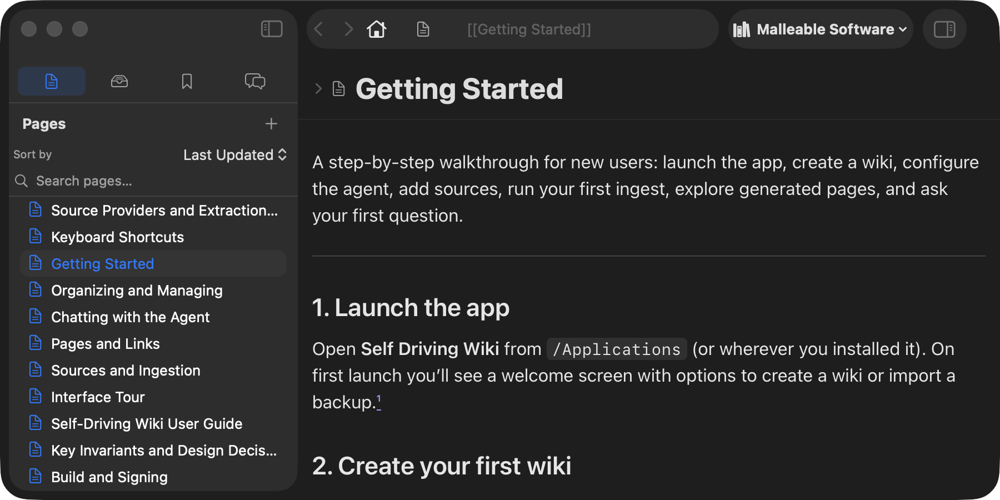

# Interface Tour

The Self-Driving Wiki window follows familiar macOS patterns: a navigation
sidebar on the left, a content area in the center, and a toolbar up top. If
you've used Safari or Xcode, the basics are second nature.

---

## Window overview

The standard **Window menu** lists every open wiki window (by name) below
"Bring All to Front" — click one to bring it to the front.

---

## The sidebar

The left sidebar has a **section selector bar** at the top — four evenly spaced
icons, like Xcode's navigator. Click one to switch sections:

| Icon | Section | What's here |
|---|---|---|
| 📄 | **Pages** | All wiki pages, sorted alphabetically. Search bar at top. Click to open in a tab. |
| 📎 | **Sources** | All source materials (PDFs, web pages, notes). Search bar at top. Status indicators show ingest/extract state. |
| 🔖 | **Bookmarks** | Your personal folder tree of shortcuts to pages, sources, and chats. |
| 💬 | **Chats** | Your conversation history with the agent. Search bar at top. Live indicator on active chats. |

Each section has action buttons in its header (e.g., **+ New Page**, **Add from
URL**, **+ New Folder**) and supports right-click context menus on rows.

### Sidebar search

The Pages and Sources sections have a search bar at the top. Typing triggers
**semantic search** — results are ranked by meaning, not just text matching. So
searching for "neural networks" will find a page titled "Deep Learning" even if
those exact words don't appear.

### Drop zone

The entire window is a drop target. Drag a file from Finder, or drag a URL from
a browser, anywhere onto the window — a blue accent border appears as feedback.
Dropped files are ingested as sources; dropped URLs are fetched and added.

---

## The toolbar

### Omnibox (address bar)

The omnibox lives in the center of the toolbar — like Safari's address bar.

| State | What it shows |
|---|---|
| **Idle** (not focused) | The current page/source/chat as a wiki link: `[[Page Title]]`. A leading icon shows the content type. |
| **Focused** (clicking or ⌘L) | A semantic search field. Type to see ranked suggestions (pages, sources, chats, bookmarks). Arrow keys to navigate; Enter to open. |

**Surrounding controls:**
- **Back / Forward** arrows (⌘[ / ⌘]) for navigation history.
- **Home** button (if a home page is configured for the wiki).
- **Page menu** (leading icon click) — Zoom controls and "Find on Page…".
- **+** bookmark button (appears on hover) — quickly add the current page/source to bookmarks.

### Wiki switcher

The wiki switcher is at the right end of the toolbar — like a browser profile
selector. It shows the current wiki's name with a books icon.

- **Click** a wiki → opens it in a **new window** (Safari-style).
- **Option-click** a wiki → switches the current window to that wiki in place.
- A checkmark marks the active wiki.
- **New Wiki…** creates a new wiki.
- **Rename / Export / Delete** the active wiki.
- **Import Wiki Backup…** restores from a `.sqlite` backup.

### Change log toggle

The rightmost toolbar button toggles a **change log sidebar** — a trailing panel
that shows `log.md`, the agent's chronological operation history. Click again to
hide it.

---

## The tab bar

When you have two or more pages/sources/chats open, a **tab strip** appears at
the top of the detail pane — just like Safari tabs.

| Action | How |
|---|---|
| Open in a new tab | Click a sidebar item (it may open in the current tab or a new one depending on type). |
| Switch tabs | Click a tab; ⌘1–⌘9 for the first nine; or ⇧⌘[ / ⇧⌘] to cycle (wraps around). |
| Close a tab | Click the × on the tab (appears on hover), or ⌘W. |
| Close while editing | A confirmation appears: "Close Tab? Unsaved changes will be discarded." |
| Reopen a closed tab | ⌘⇧T (remembers up to 10 recently closed tabs). |
| Right-click a tab | Context menu: Close, Close Others, Close Tabs After, Close All. |

Tabs show a content-type icon and the title. The active tab has a colored
underline. If there are too many tabs to fit, a **⌄ overflow menu** lists them all.

---

## The detail pane

The detail pane is where you read pages, view sources, chat with the agent, or
edit the system prompt. It fills the main content area.

**What appears here depends on what you've opened:**
- **Page** — rendered Markdown reader (or raw editor in edit mode).
- **Source** — source detail view (metadata, extraction, PDF viewer, markdown).
- **Chat** — conversation interface with the agent.
- **System Prompt** — the agent's instructions (reader/editor).
- **Change Log** — the operation history (rendered Markdown).

When the detail pane is empty (no tabs), a welcome screen appears with buttons
to create pages, add sources, or start a chat.

---

## Trailing sidebars

Two optional trailing panels can open inside the detail area (they compress
content inwards rather than growing the window):

| Panel | Toggle | What it shows |
|---|---|---|
| **Outline** | `sidebar.right` icon in the page/source/chat header | A list of headings. Click to scroll to that section. |
| **Change Log** | `sidebar.trailing` button in the toolbar | The agent's `log.md` — what it did and when. |

---

## Menu bar item

Self-Driving Wiki runs a **menu bar item** (a small books icon in your menu bar)
even when no window is open. This lets you monitor agent work in the background.

| Icon state | Meaning |
|---|---|
| Outline books | Idle — nothing running. |
| Filled books | Working — agent or extraction in progress. |
| (tooltip) | Shows counts: "Processing (N active, M queued)" or "Paused" or "Attention needed." |

**Menu contents:**
- **Open [wiki]** — list of all wikis; click to open/focus a window.
- **Agent Queue…** (⌘I) — opens the ingestion/lint activity window.
- **Extraction Queue…** (⌘E) — opens the extraction activity window.
- **Maintenance** → Vacuum All, Agent Instructions.
- **Settings…** — opens preferences.
- **About** / **Quit** (⌘Q).

When you queue an operation, a brief hint popover appears: *"Ingest queued."*
