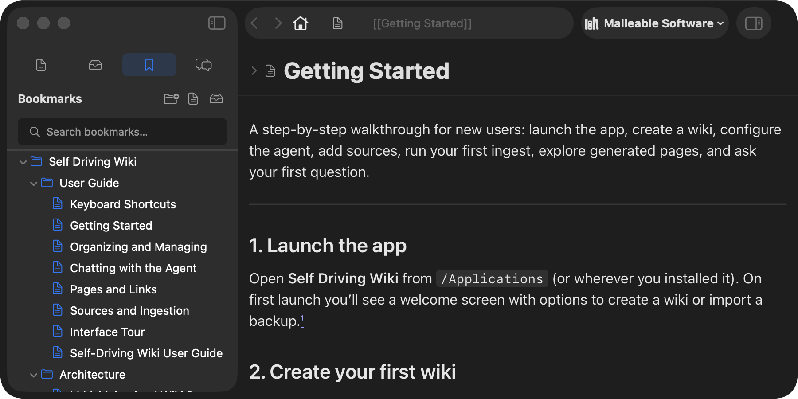

# Organizing & Managing

This page covers everything related to organizing your knowledge base and
managing the app: bookmarks, search, navigation, multiple wikis, settings, the
activity queue, and notifications.

---

## Bookmarks

Bookmarks are your personal table of contents — a folder tree of shortcuts to
pages, sources, and chats you want to reach quickly.

### The Bookmarks sidebar

Switch to the **Bookmarks** section (🔖 icon). You see a native outline view
with:
- **Folders** — organize bookmarks hierarchically. Nested subfolders supported.
- **Page references** — shortcuts to wiki pages.
- **Source references** — shortcuts to sources.
- **Chat references** — shortcuts to chat conversations.
- **Stale refs** — if a target was deleted, a ⚠️ warning icon appears (the node
  is preserved, not auto-deleted).

### Adding bookmarks

| Method | How |
|---|---|
| **From the omnibox** | Hover on any page/source/chat → **+** button appears → click to add to bookmarks root. |
| **From Pages/Sources lists** | Multi-select rows → right-click → **Add to Bookmarks…** → pick or create a destination folder. |
| **From a wiki link** | Right-click a resolved `[[link]]` in any reader → **Add Bookmark…** → pick a folder. |
| **From Bookmarks header** | Click **+** → New Folder / Add Page… / Add Source… → search picker. |
| **Drag and drop** | Drag a wiki-link from the page body, or drag the omnibox **+** button onto the bookmarks tree. |

### Organizing bookmarks

- **Drag to reorder** — within the same parent or between folders. Multi-select
  drag supported.
- **Right-click context menu:**
  - Open / Open in Background / Open With (single items).
  - Edit… — rename the folder or ref, view target info and timestamps.
  - Add Page… / Add Source… / New Subfolder (folders only).
  - Delete (batch supported).
- **Search** — filters by resolved titles. Ancestor folders auto-expand so
  nested hits are visible.

### The BookmarkTargetPickerSheet

When you bookmark from the Pages or Sources list, a sheet asks **where** to file
it:
- Shows your folder tree with radio-style selection.
- **Create folder** inline — type a name and add a new destination on the spot.
- Root ("Bookmarks") is available for top-level items.
- Header shows count: *"Add 3 Pages to Bookmarks."*

### Use case: ask the agent to build an outline, then open it in Obsidian

You don't have to file bookmarks by hand. Because the agent can create and
organize bookmarks the same way you can, you can hand it a curation task in
Chat:

> *"Create a bookmark folder called **Reading List** with subfolders for each
> author, and file every source and its summary page under the right author.
> Add a **Key Chats** folder with the conversations where we worked out the
> methodology."*

The agent builds the folder tree and files pages, sources, and chats into it.
Now the payoff: the **File Provider mount** (the optional read-only folder the
wiki exposes in Finder) projects that same bookmark tree to disk under a
top-level `bookmarks/` folder —

- Bookmark **folders** become real folders.
- **Page** and **chat** bookmarks become `.md` files (chats render as a
  transcript).
- **Source** bookmarks appear as the original file.
- `[[Wiki links]]` inside the pages are rewritten to **relative paths**, so they
  resolve *within* the exported folder layout.

That last point is what makes the tree a working Obsidian vault, not a flat
dump. Point Obsidian (or any Markdown editor) at the wiki's mount folder — or
just the `bookmarks/` subfolder — and you get the exact outline the agent built,
with clickable links between pages. The agent organizes; you read the result in
your editor of choice.

> The mount is **read-only** — edits happen in the app or through the agent, and
> the folder re-projects automatically. See
> [multiple wikis](#multiple-wikis) for enabling a per-wiki mount.

---

## Search

### Sidebar search (Pages & Sources)

Each sidebar section has a search bar at the top. Typing triggers **semantic
search** — meaning-based ranking, not just text matching:
- Searching "machine learning" finds pages about "deep learning" or "neural networks."
- Results are ranked by relevance using local embeddings.
- FTS5 (full-text search) is fused with semantic similarity for a hybrid ranking.

### Omnibox search (⌘L)

The address bar doubles as a global search:
1. Press **⌘L** to focus.
2. Type — results appear in a dropdown below.
3. Suggestions include **pages, sources, chats, and bookmarks**.
4. **Arrow keys** navigate; **Enter** opens; **Escape** dismisses.

### Chats search

The Chats sidebar has its own search bar with hybrid full-text + semantic search
across chat titles and content.

---

## Navigation

| Action | Shortcut / Method |
|---|---|
| Go back | ⌘[ or Back arrow in toolbar |
| Go forward | ⌘] or Forward arrow in toolbar |
| Go home | Home button in toolbar (if configured) |
| Focus address bar | ⌘L |
| Find on page | ⌘F |
| Switch to tab N | ⌘1–⌘9 |
| Reopen closed tab | ⌘⇧T |
| Close tab | ⌘W |
| Follow wiki link | Click `[[link]]` in any reader |
| Show in List | "Show in List" button in any detail header |

---

## Multiple wikis

You can have **many wikis** — each is a self-contained knowledge base with its
own pages, sources, chats, and agent.

### Creating wikis

- **Wiki switcher** (toolbar) → **New Wiki…** → name it → Create.
- Each wiki gets its own SQLite database and (optionally) its own File Provider
  mount folder.

### Switching between wikis

| Action | What happens |
|---|---|
| **Click** a wiki in the switcher | Opens it in a **new window** (Safari-style). Each wiki gets its own window. |
| **Option-click** a wiki | Switches the **current window** to that wiki in place (no new window). |

### Wiki operations

From the **wiki switcher** menu:

| Operation | Description |
|---|---|
| **New Wiki…** | Create a new knowledge base. |
| **Rename [name]…** | Change the display name. |
| **Export [name]…** | Save a SQLite backup of the entire wiki. |
| **Delete [name]…** | Permanently remove the wiki and all its data. |
| **Import Wiki Backup…** | Restore from a `.sqlite` export. Prompts for a display name. |

### Multi-window

- Each wiki opens in its own window with its own session.
- Two windows over the **same** wiki share one underlying session (one database,
  one event bus) — edits in one window are visible in the other.
- A long ingest in wiki A's window does **not** block a query in wiki B's window
  (per-wiki isolation).

---

## Settings

Open with **⌘,** or **menu bar → Settings…**

### About

- App icon, name, version, build, and git SHA.
- Opens by default when you first visit Settings.

### Agents

Configure the AI providers that power the agent:

- **Provider list** — add, remove, enable/disable, mark default.
  - Each provider: label, launch command, environment variables, API key
    (Keychain-backed), model selection.
  - **Test Connection** verifies the provider works.
- **Ingestion stages** — route different stages (Planner, Executor, Finalizer)
  to different providers/models. Use a strong model for planning, a cheaper one
  for bulk reading.
- **Permission mode** — Bypass (autonomous) or Always Ask (approval-gated).
- **Models** — auto-captured from the first chat; you can't manually refresh
  (they're discovered live).

### Extraction

Configure PDF-to-markdown conversion:

- **Backend picker** — Local pdf2md, Claude, Gemini, or Docling Serve.
- **Per-backend config** — API keys (Keychain), model name, base URL.
- **Test Connection** per backend — live verification.
- Settings are locked (grayed out) while an extraction is running.

### Zotero

Connect your Zotero reference library:

- **API Key** — Keychain-backed.
- **Library ID** — your Zotero library/group ID.
- **Local library folder** — override the default Zotero data directory.
- **Test Connection** — verifies credentials.

### General

- **Ask before quitting** (default on) — catches ⌘Q, Apple menu Quit, Dock Quit,
  and shutdown. You can still quit via the dialog or by disabling this.

---

## The activity queue

All extraction and ingestion operations flow through a **persistent queue**.

### What the queue does for you

- **Survives relaunch** — in-flight items are re-queued after a crash or restart.
- **Runs in the background** — operations continue even with no window open.
- **Ingestion is serialized** — one job runs at a time globally (per-provider
  limit 1). A per-wiki invariant additionally prevents double-ingesting a
  wiki.
- **Extraction concurrency depends on the backend** — local pdf2md runs one
  extraction at a time; remote backends (Claude, Gemini, Docling Serve) allow
  up to 2 concurrent extractions.
- **Ordering** — drag to reorder queued items.

### Queue controls

| Control | Where | What it does |
|---|---|---|
| **Pause Queue** | Activity window toolbar | Stops new starts. Running jobs finish. Resume starts dispatch again. |
| **Stop All…** | Activity window toolbar, under Queue Actions | Pauses this queue and cancels its running jobs. Queued jobs stay queued. The confirmation states this before you confirm. |
| **Cancel** | Per-item button | Cancels one running or queued job. |
| **Retry Job** | Per-item button | Runs a failed or cancelled job again as a new attempt. The whole job runs again. It does not keep the old attempt's results. |

### Activity windows

| Window | Shortcut | Contents |
|---|---|---|
| **Agent Queue** | ⌘I | Ingestion and lint jobs. |
| **Extraction Queue** | ⌘E | PDF-to-markdown jobs. |

Both windows share one job workspace:

- **Left: job navigator.** The **Active** section lists running and queued jobs. The **Recent** section lists up to 200 finished jobs. Drag to reorder queued jobs. Reordering turns off while filters or search are active.
- **Search field** at the top. Search covers loaded jobs only: kind, wiki name, target names, and recorded outcome text. While summaries load, the footer labels the search incomplete.
- **Filter menu** covers State, Wiki, and Operation. Active filters show a **Clear Filters** action.
- If filters hide the selected job, the workspace stays open. It shows the notice "Selected job is outside this filter" with a **Clear Filters** action.
- Per-item status: spinner (running), clock (queued), ✓ (completed), ⚠️ (failed), ✕ (cancelled).
- Context menu: Reveal Source, Reveal Debug Folder, Cancel, Retry, Copy Error.

### The job workspace

Select a job to open its workspace on the right.

- **Header** — the job title prefixed with its operation ("Ingestion: Research papers", "Lint: Check selected pages"), the wiki, the state, and one elapsed clock. Queued and running jobs show **Cancel**. Failed and cancelled jobs show **Retry Job**.
- **Overview** — the complete list of targets for the job. Each row shows the target's name and one state or result. Rows do not expand. The name itself is the link: selecting it performs the row's action — **Open Page** for pages, **Reveal Source** for sources, **Browse Pages** for a whole-wiki scope. Rows never show IDs. Long names wrap to two lines, and the full recorded name stays available as the row's tooltip. Batches of 12 or more targets add a local search field.
- **Activity** — the typed transcript for the job. Extraction jobs without a transcript show progress text instead.

The toolbar's **Run Details** toggle opens the Run Details inspector beside the workspace. The inspector shows the recorded enqueue, start, and finish times, the duration, the attempt, the actual provider and model, and usage. Absent values show **Not Reported**. The inspector is optional. Opening or closing it changes nothing else: your selection, filters, and queue state stay as they are.

Overview rows show **Planned** until a target has recorded evidence. Planned is not a result. It never reads as success or as a count of zero. The section result line still states absence where it matters, for example "Agent run completed; page-level results not reported" for a lint run without page results. The Run Details inspector keeps **Not Reported** for absent provider or model facts.

---

## Notifications

| Type | When | What you see |
|---|---|---|
| **macOS notification** | Extraction, ingestion, or lint reaches a terminal state | Banner with title + summary (e.g., "Ingestion complete — 3 files processed"). Appears as a banner when the app is in the background; silent in Notification Center when frontmost. |
| **Hint popover** | You queue an operation | Brief 2.5s popover anchored to the menu bar icon: "Ingest queued." |
| **Menu bar tooltip** | Agent state changes | "Idle" / "Processing (N active, M queued)" / "Paused" / "Attention needed" |
| **Menu bar icon** | Agent state changes | Fills in (books.vertical.fill) while working; outline when idle. |

Cancelled items do **not** trigger notifications (user-initiated, not actionable).

---

## The change log

The change log is the agent's **operation history** — an append-only `log.md`
that records every ingest, lint run, and significant event.

**Access:**
- Toggle the **change log sidebar** from the toolbar (sidebar.trailing icon).
- Or open the Change Log tab directly.

**What you see:**
- Formatted Markdown rendered in the reader.
- Each entry is timestamped and describes what the agent did.
- Wiki links in the log are clickable — navigate to referenced pages.

**Empty state:** "No Log Entries — Agent runs will append their notes here."

---

## The system prompt

The system prompt (`CLAUDE.md` / `AGENTS.md`) is the instruction set the agent
reads at the start of every run. It tells the agent how to format pages, when to
create links, what conventions to follow, etc.

**Access:** Menu bar → **Maintenance** → **Agent Instructions**, or open the
System Prompt tab.

**Editing:**
- Click **Edit** (or ⌘E) to enter edit mode.
- Save with ⌘S. Changes take effect on the next agent run.
- The header explains: *"The agent reads this each run."*

Customizing the system prompt is how you control the agent's behavior — e.g.,
asking it to use a specific citation style, create pages of a certain length, or
focus on particular themes.
