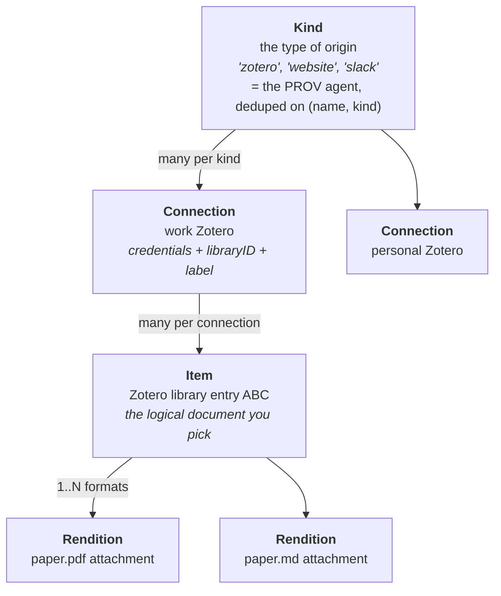
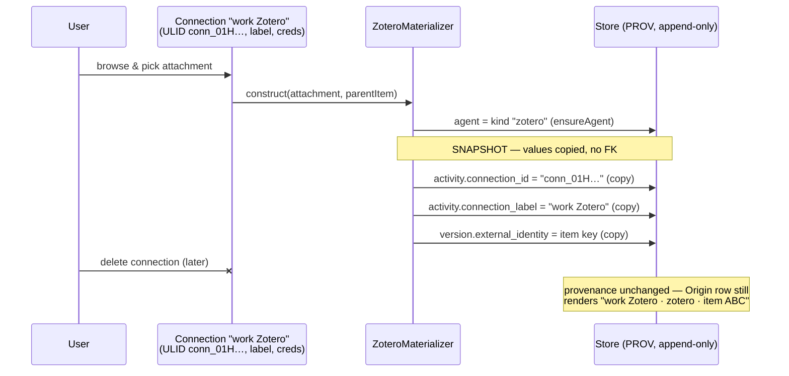
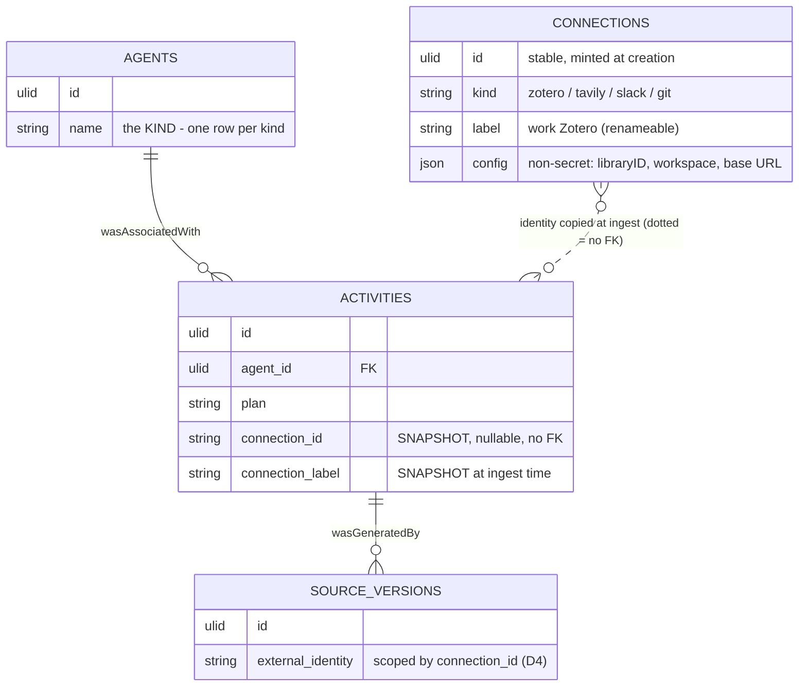
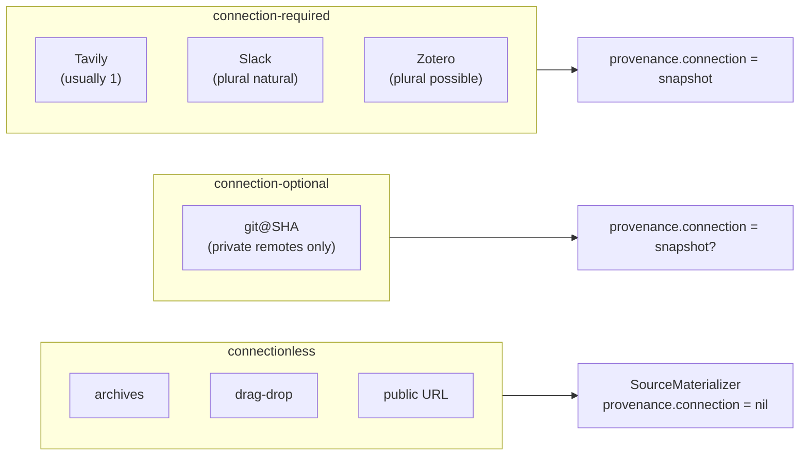
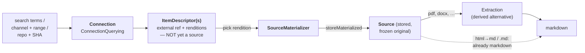

# Connections — configured origins, distinct from provenance

**Parent design:** [`graph-model-and-versioning.md`](graph-model-and-versioning.md) §11
(materializer protocol), §4.7 (PROV-DM). **Sibling:**
[`source-format-materializers.md`](source-format-materializers.md) (origin/format
two-level dispatch). **Drives:** issue #261 (Phase 7 origins: git@SHA, Tavily,
Slack, archives) and the Phase-3b credentials UX.

**Status: design. No schema change until the first connection-requiring origin
ships (likely Tavily or Slack).**

## The problem this names

"Source provider" was one word doing four jobs. The rename to
`SourceMaterializer` fixed the bottom of the stack; this document names the
rest and locks one invariant:

> **A connection is mutable configuration. Provenance is immutable history.
> Provenance snapshots connection identity at ingest; deleting a connection
> never touches provenance.**

Concretely: a user can hold two Zotero connections ("work", "personal"), delete
one, and every source ingested through it keeps a fully renderable Origin row.

## The four layers



| Layer | What it is | Where it lives today |
|---|---|---|
| **Kind** | The type of origin | `agents` row (`ensureAgent`, deduped on `(name, kind)`) |
| **Connection** | A configured, credentialed *instance* of a kind | **does not exist yet** — this plan |
| **Item** | The logical document picked from a connection | latent: `external_identity` (e.g. Zotero item key) |
| **Rendition** | One concrete byte-blob/format of an item | a `source` + its active `source_versions` row |

`SourceMaterializer.materialize()` operates at **Rendition**: it is handed one
already-chosen artifact and produces one `MaterializedSource`. Browse/pick/
format-choice all happen above it, before the materializer is constructed.
Nothing in this plan changes the materializer protocol.

**The test for "is X a connection":** does the origin have configured,
credentialed, *reusable* state that exists before — and independent of — any
single ingest? A Tavily API key exists with zero sources ingested; a drag-drop
has no state at all. That pre-existence is exactly why connection identity
cannot live purely in provenance columns (which are only born at ingest).

## The snapshot invariant



Rules, in decision-table form:

| Decision | Choice | Rejected alternative | Why |
|---|---|---|---|
| D1 | Connection identity is **copied** onto the activity at ingest (value snapshot) | FK from `activities` → `connections` with cascade/RESTRICT | History must survive config deletion; matches the existing discipline (`activities.plan` snapshots the request URL; git commits copy author strings) |
| D2 | The **agent stays the kind** — one `"zotero"` row regardless of connection count | agent-per-connection (`"zotero:work"`) | Keeps "everything from Zotero" a single join; avoids unbounded agent rows; connection is an *instance* dimension, not a new kind |
| D3 | Snapshot = stable **connection ULID** (minted at connection creation) + **label at ingest time** | label only / id only | ULID survives renames and is the grouping key; the label keeps the Origin row human-readable after deletion (no orphan ULIDs in UI) |
| D4 | `external_identity` is logically scoped by connection id: the item-grouping key is `(connection_id, external_identity)` | `external_identity` alone | Zotero item keys (and Slack ts, git SHAs in forks) can collide across libraries/workspaces |
| D5 | Refresh on a deleted connection **fails gracefully** ("connection no longer exists") | block deletion while sources exist | Deletion is a config act; capability loss ≠ history loss. A "re-bind orphaned sources to another connection" verb is deferred |
| D6 | Credentials live in **Keychain**, keyed by connection ULID; the `connections` row holds only non-secret config | secrets in SQLite | Matches the Zotero/extraction-backend precedent (`ExtractionCredentialStore`) |

## Schema sketch (deferred until first consumer)



- `connections` is a small mutable table (or a `wikis.json`-style registry —
  open question below). Everything to the right of it is append-only and
  independent.
- `activities` gains two **nullable** columns (`connection_id`,
  `connection_label`) in an additive migration. NULL = connectionless origin
  (drag-drop, archive, public URL) — the common case stays untouched.
- `SourceProvenance` (the value type) gains the same two optional fields;
  `SourceOrigin` (the read projection) mirrors them for the Origin row.

## Issue #261 origins, classified

#261 frames git@SHA / Tavily / Slack / archives as "each a leaf against the
provider protocol, no schema changes." That holds at the **Rendition** layer —
each is a `SourceMaterializer` conformer — but they differ sharply at the
**Connection** layer:

| Origin | Connection? | Pre-existing state | Item identity (`external_identity`) | Notes |
|---|---|---|---|---|
| **Archives** (`.zip`/`.tar.gz`) | **None** | none — local bytes, like drag-drop | none (local) | One source per contained file, all sharing one `import` activity (the website-snapshot sibling pattern). Ship first: zero connection dependency. |
| **git@SHA** | **Optional** | none for a local clone / public remote; credentials for private remotes | `repoURL@SHA` (+ path for per-file sources) | Local/public path ships connectionless like archives. A "GitHub (work)" connection (PAT in Keychain) is additive later — the materializer takes an optional connection snapshot. |
| **Tavily** | **Required** | API key | result URL (it fetches web content) | Almost always singleton-per-kind, but it *is* a connection: the key exists before any ingest, is testable ("Test Connection"), revocable. Reuse the extraction-backend settings pattern. |
| **Slack** | **Required, plural-natural** | workspace token + workspace id | `channel_id:thread_ts` (or export-file path for archive imports) | The origin that justifies plural connections more than Zotero: work Slack vs community Slack is the normal case, and item ids collide across workspaces — D4 is load-bearing here. |
| *(Zotero, retrofit)* | **Required, plural-possible** | API key/local dir + libraryID | parent item key | Today a singleton config; becomes connection #1 when the table lands. Existing sources keep NULL `connection_id` (pre-connection provenance is still honest). |

The gate in #261 ("each materializes a frozen, provenance-carrying source via
`materialize` → `storeMaterialized` → `addSource`") is unchanged. What this
plan adds: **connection-requiring origins thread a connection snapshot into
their `SourceProvenance`**; connectionless ones pass nil, exactly like today.



## External interface — query in, markdown out (eventually)

The desired ergonomics: *a connection takes input (search terms, a channel +
date range, a repo + SHA) and gives back something I can hand to a
materializer; out the other end comes markdown.* That pipeline is right, but it
has two named seams that must not be collapsed:



**Seam 1 — a query returns `ItemDescriptor`s, not sources.** A *source* is the
stored thing (ULID, blob, versions, provenance). A query result is an external
reference plus its available renditions — the **Item** layer made concrete.
`ZoteroMaterializer` already consumes exactly this shape, unnamed: its
`(attachment, parentItem)` constructor pair *is* an item descriptor.

```swift
/// What a connection's query returns: one pickable external item.
public struct ItemDescriptor: Sendable {
    public let connectionID: String        // the connection ULID (snapshot key)
    public let itemIdentity: String        // → external_identity (D4 scope)
    public let title: String
    public let renditions: [RenditionDescriptor]  // 1..N
}
public struct RenditionDescriptor: Sendable {
    public let renditionIdentity: String   // attachment key / file path / ts
    public let contentType: String?        // drives pick policy + format dispatch
    public let label: String               // "paper.pdf", "#general 2024-07"
}

/// The connection-side query interface. Kind-specific input, uniform output.
public protocol ConnectionQuerying: Sendable {
    associatedtype Query: Sendable         // ZoteroQuery / SlackQuery / TavilyQuery / GitRef
    func query(_ input: Query) async throws -> [ItemDescriptor]
}
```

Each kind then supplies a factory `descriptor → SourceMaterializer` (with the
connection snapshot threaded into the resulting `SourceProvenance`). The
materializer protocol itself is untouched — it stays the zero-argument
"one rendition already chosen" leaf.

**Seam 2 — the materializer does not promise markdown.** Markdown appears at
two different places, both already built:

- *Format dispatch* (`FormatMaterializer`): HTML→Markdown at ingest; `.md`
  verbatim. Synchronous, part of materialization.
- *Extraction* (`source_markdown_versions`, Phase 2 backends): PDF→Markdown as
  a **derived alternative** with its own PROV activity, re-runnable. Folding
  this into the materializer would break two paid-for invariants: the stored
  source is the frozen *original* (refresh depends on it), and a bad
  conversion is a pointer move away from replacement, not a re-fetch.

"Give me markdown" is therefore an **orchestration**, not a protocol method:

```
ingest(connection:, query:) → pick → materialize → store → (extract if needed) → markdown
```

That orchestration is also where the **rendition-pick policy** lives for
no-human-in-the-loop callers (agents, `wikictl connection search|ingest`, MCP):
default *prefer a markdown/text rendition when the item has one; else ingest
the best original and run extraction*. The browse UI and the agent path share
the same `query` seam and differ only in who picks.

## Where the existing code falls short

Grounded gaps and latent bugs this design will hit, worst first:

1. **Rendition ambiguity — two renditions are indistinguishable in
   provenance.** `ZoteroMaterializer` stamps `externalIdentity =
   parentItem.key` (`SourceMaterializer.swift:444`) — the *parent* item key.
   Ingest the PDF and the MD attachment of one item and you get two sources
   with identical `external_identity` and no recorded attachment key
   (`externalRef` is left nil on the import activity). Grouping works by
   accident; telling the renditions apart, deduping "already ingested this
   attachment", or refreshing the right one does not. Fix: keep the item key
   in `external_identity` (it's the D4 grouping key) and record the
   *rendition* identity (attachment key) in `activities.external_ref`, which
   is documented as exactly this ("provider-scoped stable identity",
   `SourceMaterializer.swift:39`) and unused on the Zotero path today.

2. **Byteless uniqueness will break under plural connections.** The partial
   unique index `ON source_versions(external_identity) WHERE blob_hash IS
   NULL` (`SQLiteWikiStore.swift:538`) is keyed on `external_identity`
   *alone*. Two connections to two Slack workspaces (or two Zotero libraries)
   can legitimately yield byteless sources with colliding external ids → a
   spurious UNIQUE violation on the second ingest. When `connection_id`
   lands, this index must become `(connection_id, external_identity)` —
   the concrete schema consequence of D4.

3. **Refresh reconstructs materializers from `agentName` alone and has
   nowhere to find credentials.** `SourceRefreshService` switches on
   `SourceOrigin.agentName` and hard-codes Zotero (and every import-kind) as
   `.notRefreshable` (`SourceRefreshService.swift:10-15`). Connection-backed
   sources are refreshable *in principle* (re-query the API by rendition
   identity) but the origin row carries no `connection_id` to look up
   credentials with. The snapshot columns are the missing input; D5's
   "connection no longer exists" error slots in as a fourth `RefreshError`
   case alongside `.notRefreshable`/`.missingPlan`/`.snapshotWithImages`.

4. **No query seam exists in core.** Browse/pick is welded to the UI:
   `AddFromZoteroSheet.swift:304` filters `ZoteroClient` results directly.
   There is no `ConnectionQuerying` abstraction, so nothing non-UI (agent,
   `wikictl`, MCP) can search a connection. `ZoteroClient` is ~the right body
   for the first conformer; it needs the protocol carved out above it and its
   results mapped to `ItemDescriptor`s.

5. **The picker's ingestability filter disagrees with format dispatch.**
   `ZoteroAttachment.isIngestable` allowlists PDF + `text/*` + `.pdf`/`.md`
   suffixes (`ZoteroClient.swift:282-291`), but `FormatMaterializer.dispatch`
   happily handles HTML (→ Markdown), EPUB, images, and arbitrary binary. So
   the picker hides renditions the pipeline can now ingest — an HTML snapshot
   attachment is invisible even though the two-level-dispatch work *fixed*
   its handling. `RenditionDescriptor.contentType` should drive this from
   format capability, retiring the per-kind heuristic.

6. **`ZoteroMaterializer` assumes local Zotero storage — connection #2 can't
   exist.** It requires a `zoteroDir` and resolves via `ZoteroLocalStorage`
   (`SourceMaterializer.swift:404-417`); one machine has one local Zotero
   profile, so a second account's attachments are unreachable. Plural Zotero
   connections require a web-API download path in the materializer (the
   Zotero API supports it), with local-dir as the fast path for the
   connection that owns the local profile.

7. **`SourceProvenance`/`SourceOrigin` carry no connection fields.** Additive:
   optional `connectionID`/`connectionLabel` on both value types, threaded
   through `addSource`/`appendContentVersion` into the two new nullable
   `activities` columns, and joined back in `sourceOrigin(sourceID:)`
   (`SQLiteWikiStore.swift:3072`).

8. **Two smaller sharp edges.** (a) `ensureAgent` is first-writer-wins: it
   dedups on `(name, kind)` and silently ignores `version`/`externalRef` on
   every subsequent call (`SQLiteWikiStore.swift:3199-3206`) — fine for
   connections (identity goes on the activity, per D2), but a trap if anyone
   later tries to stash per-connection or per-version data on the agent.
   (b) `SourceOrigin.displayLabel` is a hard-coded switch over known agent
   names (`SourceMaterializer.swift:147-158`); once labels are snapshotted,
   the Origin row should prefer `connection_label` ("work Zotero") and fall
   back to the kind label.

Items 1, 4, and 5 are pre-schema — fixable now against existing columns.
Items 2, 3, 6, 7 land with the `connections` substrate (step 4 below).

## Rollout plan

Five stages. Each is independently shippable, ordered so that no stage
requires speculative schema, and each closes specific findings from the gap
audit above. Stages C1/C2 are code-only; the single schema migration is
confined to C3. The connectionless #261 leaves (archives, local/public git)
are **not** in this plan — they have zero connection dependency and can ship
in parallel at any time.

### Stage C1 — Provenance correctness (pre-schema, ship now)

Fixes the bug being written into every Zotero ingest today. Closes audit
items **1** and **5**. No migration, no new types.

| Task | Change |
|---|---|
| C1.1 | `ZoteroMaterializer` records the **attachment key** in `SourceProvenance.externalRef` (→ `activities.external_ref`, currently nil on the Zotero path). `external_identity` keeps the parent item key (D4 grouping). |
| C1.2 | Retire the `isIngestable` allowlist as the gate: derive rendition ingestability from `contentType` via what `FormatMaterializer.dispatch` accepts (everything — so the filter becomes a *ranking*, PDF/text/HTML first, with binary shown but de-emphasized). HTML attachments become pickable and convert to Markdown. |
| C1.3 | Backfill audit: a one-shot `wikictl` check (not a migration) listing Zotero sources whose activity has `external_ref IS NULL` — old ingests stay ambiguous (honest history), but we know how many. |
| C1.4 | Tests: two attachments of one parent item → two sources, same `external_identity`, distinct `external_ref`; HTML attachment → `.htmlConverted` markdown source. |

**Milestone M1:** ingest the PDF *and* the MD attachment of one Zotero item;
`wikictl source info` distinguishes them; an HTML attachment ingests as
Markdown. Provenance written from M1 onward is rendition-unambiguous.

### Stage C2 — The query seam (`ConnectionQuerying`, pre-schema)

Carves the external interface out of the UI. Closes audit item **4**.
Still no schema — descriptors are transient values.

| Task | Change |
|---|---|
| C2.1 | Add `ItemDescriptor` / `RenditionDescriptor` + `protocol ConnectionQuerying` to `WikiFSCore` (shapes as spec'd above; `connectionID` is optional-until-C3, carrying the kind for now). |
| C2.2 | First conformer: `ZoteroConnection` wrapping `ZoteroClient` — maps items+attachments to descriptors. `AddFromZoteroSheet` re-sits on the descriptor list (UI renders descriptors instead of raw client rows; behavior identical). |
| C2.3 | Per-kind factory: `descriptor → SourceMaterializer` (Zotero first). This is where a chosen rendition becomes a materializer; the materializer protocol is untouched. |
| C2.4 | `wikictl connection search "<terms>"` — read-only proof that a non-UI caller can query. |
| C2.5 | Tests: descriptor mapping (multi-attachment items → one descriptor, N renditions); factory round-trip descriptor→materializer→`MaterializedSource` with correct identity fields. |

**Milestone M2:** `wikictl connection search` returns pickable
items/renditions headlessly, and the Zotero sheet runs on the same seam it
does. The pipeline `query → descriptor → materialize` exists end-to-end
minus persistence of connections themselves.

### Stage C3 — Connections substrate (the one migration)

The schema stage. Closes audit items **2**, **7**, **8b**, and decides the
registry open-question. This *is* Phase 3b's credentials UX under its real
name.

| Task | Change |
|---|---|
| C3.1 | **Migration vN:** `connections` table (per-wiki — resolve the open question; rationale: provenance is per-wiki, stays in the migration ladder) + nullable `connection_id`/`connection_label` on `activities` + **rebuild the byteless partial unique index** to `(connection_id, external_identity) WHERE blob_hash IS NULL` (audit #2 — do it in the same migration so the collision window never opens). |
| C3.2 | Keychain credential store keyed by connection ULID (pattern: `ExtractionCredentialStore`). Secrets never in SQLite (D6). |
| C3.3 | `SourceProvenance`/`SourceOrigin` gain optional `connectionID`/`connectionLabel`; threaded through `addSource`/`appendContentVersion` and joined back in `sourceOrigin(sourceID:)`. |
| C3.4 | **Zotero retrofit:** existing singleton config becomes connection #1 (minted ULID, label "Zotero"); new ingests snapshot it; pre-C3 provenance stays NULL (honest). Settings UI: connection list (add/rename/delete/Test Connection), mirroring the extraction-backend per-backend pattern. |
| C3.5 | `SourceOrigin.displayLabel` prefers the snapshotted `connectionLabel`, falls back to the kind switch (audit #8b). |
| C3.6 | Tests — the invariant tests are the point of the stage: create connection → ingest → **delete connection → origin row still renders label/id**; rename connection → old provenance keeps old label, new ingest snapshots new label; two connections + colliding byteless `external_identity` → both insert cleanly. |

**Milestone M3 (the invariant milestone):** two Zotero connections coexist;
deleting one leaves every origin row intact and renderable. `changeToken`
extended if connections are user-visible state (decide during C3.1).

### Stage C4 — First connection-required origin + orchestration

Proves the substrate with a second kind and ships the "query in, markdown
out" ergonomics. **Pick Tavily first** (single API key, no OAuth, results are
URLs so `WebsiteMaterializer`'s format dispatch is reused nearly verbatim);
Slack is the stress test and follows in its own leaf plan.

| Task | Change |
|---|---|
| C4.1 | `TavilyConnection: ConnectionQuerying` (search → result descriptors) + `TavilyMaterializer` (or reuse `WebsiteMaterializer` with Tavily provenance — decide in-leaf) with connection snapshot threaded. |
| C4.2 | The **orchestration function** (use-case layer, not protocol): `ingest(connection:query:policy:) → [SourceID]` — query, apply rendition-pick policy (*prefer markdown/text rendition; else best original + extraction*), materialize, store, kick extraction where needed. |
| C4.3 | `wikictl connection ingest` + MCP tool on the same orchestration. |
| C4.4 | Tests: policy picks md-over-pdf when both exist; pdf-only item → source stored + extraction recorded; provenance carries the Tavily connection snapshot. |

**Milestone M4 (your sentence, running):** `wikictl connection ingest tavily
"<search terms>"` returns markdown-backed sources headlessly — input in,
markdown out, with full connection-snapshot provenance.

### Stage C5 — Refresh + plural-Zotero reach

Closes audit items **3** and **6**. Depends on C3's columns.

| Task | Change |
|---|---|
| C5.1 | `SourceRefreshService` gains a connection lookup: origin has `connection_id` → resolve connection → reconstruct materializer by rendition identity (`external_ref`) → re-materialize. New `RefreshError.connectionDeleted` (D5's graceful failure) joins `.notRefreshable`/`.missingPlan`/`.snapshotWithImages`. |
| C5.2 | Zotero web-API download path in `ZoteroMaterializer` (audit #6): local-dir stays the fast path for the profile-owning connection; other connections fetch via the API. This is what makes Zotero connection #2 *actually usable*, not just configurable. |
| C5.3 | Tests: refresh a connection-backed source → new content version, same connection snapshot on the new activity; refresh after connection deletion → `.connectionDeleted`, provenance untouched. |

**Milestone M5:** a Zotero source refreshes through its connection; a second
Zotero account's attachments ingest via the web API; deleting a connection
degrades refresh gracefully and nothing else.

### Deferred (unchanged)

Re-bind verb (D5), first-class Item entity (only if browse-before-pull
becomes real), private-remote git connections, Slack leaf plan (applies C4's
pattern; its plural-workspace case is why C3.1's index rebuild matters).

### Stage/audit cross-reference

| Audit item | Fixed in |
|---|---|
| 1 — rendition ambiguity | C1.1 |
| 2 — byteless index collision | C3.1 |
| 3 — refresh credentials lookup | C5.1 |
| 4 — no query seam | C2 |
| 5 — `isIngestable` drift | C1.2 |
| 6 — local-only Zotero | C5.2 |
| 7 — provenance fields | C3.3 |
| 8a — `ensureAgent` first-writer-wins | documented trap; no change (D2 keeps agents kind-only) |
| 8b — `displayLabel` hardcoded | C3.5 |

## Open questions

- **Connections registry: SQLite table vs JSON file?** Per-wiki `connections`
  table keeps it inside the existing migration ladder and `changeToken`; an
  app-level registry (like `wikis.json`) would share connections across wikis.
  Leaning per-wiki table — provenance is per-wiki, and cross-wiki sharing can
  be added by export/import later. Decide at C3.1.
- **Does `WebsiteMaterializer` ever become connection-optional** (authenticated
  fetches, cookies)? Out of scope; the nullable snapshot already leaves room.
- **Slack archive-file import vs live-API import** are plausibly *two* origins
  (one connectionless, one connection-required) sharing an agent kind — mirror
  of the git split. Decide in the Slack leaf's own plan.
