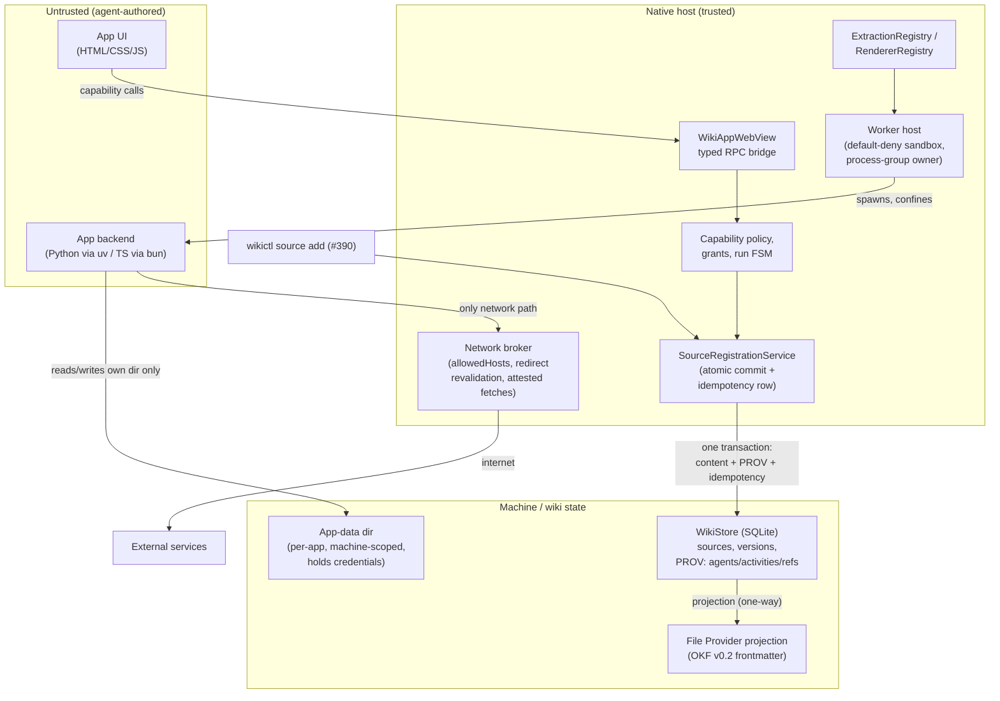
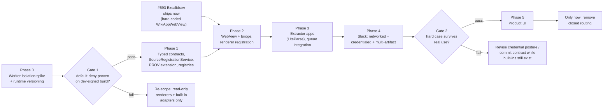
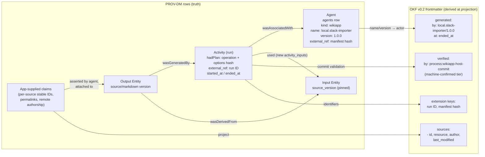
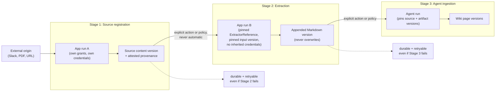

# Wiki App platform, revision 2

This plan supersedes `wiki-app-platform.md`. It keeps typed identifiers, the
capability model, staged registration, extraction, ingestion, deterministic
resolution, and immutable versions.

The adversarial review (`wiki-app-platform-adversarial-review.md`) identified
load-bearing but unproven parts. This revision restructures those parts.

The revision makes two structural changes. First, the worker sandbox becomes a
**go/no-go gate before any worker-based production routing changes**. Second,
issues #261, #390, and #593 **land on their own simple paths first**. Those paths
remain compatible with the platform and do not wait for it.

## Document map and authority

This document remains the umbrella design for worker isolation, registration,
extraction, source workflows, provenance, and staged agent ingestion. The
detailed work in those sections remains part of the plan.

Dynamic rendering now has a focused design:

- [`dynamic-renderers.md`](dynamic-renderers.md) and
  [issue #1026](https://github.com/tqbf/selfdrivingwiki/issues/1026) define the
  renderer registry, static renderer packages, renderer sessions, and
  Source/Rendered/Split presentation.
- Excalidraw issue #593 and JSON Canvas issue #594 remain the first renderer
  validation cases.

The focused renderer plan has authority when renderer details conflict with
this umbrella document. In particular, dynamic renderers do not depend on the
worker isolation gate. Renderer references in this document remain useful for
package context, provenance, and the original sequence.

Future focused plans can extract the worker, extraction, source-workflow, and
agent-capability sections. Do not remove those sections from this document
until each focused plan preserves their decisions and this index links to it.

The current document set is:

| Feature set | Design of record | Status |
| --- | --- | --- |
| Dynamic renderers | [`dynamic-renderers.md`](dynamic-renderers.md) | Proposed in #1026 |
| Worker isolation and runtime versioning | This document, Phase 0 | Gate required before worker execution |
| Shared registration and provenance | This document, Phase 1 | Near-term foundation |
| Extraction extensions | This document, Phase 3 | Depends on the worker gate |
| Source workflow applications | This document, Phase 4 | Depends on extraction and the worker gate |
| Agent ingestion capability discovery | Future focused plan. This document keeps the staged-ingestion and provenance contracts. | Not designed |

## 1. Binding status and scope

Unlike v1, this document commits to a build. Phase 0 and Phase 1 below are
near-term work; everything after Gate 1 is contingent on gate outcomes and is
explicitly non-binding until its gate passes. If Gate 1 (worker isolation)
fails, the platform re-scopes to read-only renderers plus built-in registry
adapters, and this document is amended to say so.

Scope carried over from v1 unchanged: a Wiki App is an agent-built package
(HTML/CSS/JS UI, optional `uv` or `bun` backend) providing source workflows,
extractors, and/or renderers. Native Swift owns durable writes, grants,
credentials, policy, and provenance. No generated Swift, no shell capability,
no silent dependency installation, no migration of built-ins. Ordinary
imported HTML stays script-disabled.

**Installation is per-machine.** A package is installed once on a machine
and enabled per wiki; app data stays namespaced by wiki, but the package
payload, its versions, and its credential state are machine-scoped and are
not part of any wiki's storage, backup, or sync.

Out of scope for the first release, now stated firmly rather than deferred:
host-managed credentials of any kind (authentication is out of band — see
§6), schedules/webhooks/auto sync, editable renderers, third-party package
distribution and signing, and app-owned schema migrations (see §8).

### 1.1 Component overview



Everything agent-authored sits behind two chokepoints: the bridge (for UI)
and the worker host (for backends), and all durable effects funnel through
`SourceRegistrationService` into one transaction.

### 1.2 Phase and gate map



## 2. Relationship to #261, #390, #593 (resolved, not "generalized")

v1 "generalized without closing" these issues; the review correctly called
that the worst of both options. Decision of record:

- **#593 (Excalidraw)** ships **now** on the issue's Option A: a
  self-contained read-only WKWebView in `SourceDetailView`, JS enabled,
  `network: none`-equivalent CSP, no bridge capabilities. Forward
  compatibility requirement: the view is built as `WikiAppWebView` with a
  hard-coded descriptor, not an ad-hoc branch — so when `RendererRegistry`
  exists (Phase 3) the same view is re-registered, not rewritten. This makes
  #593 the *first increment of* the platform instead of a hostage to it.
- **#390 (`wikictl source add`)** ships against a **single** typed native
  source-registration service (`SourceRegistrationService`, Phase 1). v1's
  "two surfaces that never invoke each other" is reversed: the CLI and the
  future Wiki App host are both thin callers of the same service, so
  validation, provenance, and idempotency cannot drift.
- **#261 (Slack/Tavily/git/archives)** stays open. Simple `SourceProvider`
  conformers may land on their own terms at any time; the platform does not
  block them and will wrap them as built-in registrations later, exactly as
  it wraps pdf2md and Defuddle. Slack specifically is *also* the platform's
  hard validation case (§10) — whichever lands first wins, and the platform
  adapts.

## 3. Threat model addition: the compromised authoring agent

v1's threat table defended only the runtime boundary. The dominant attack
path is upstream: untrusted ingested content → prompt-injected agent →
generated package → host capabilities. The agent runs with reads, network,
and exec open; it is the *author* of the JS, backend, manifest, and lockfile
that the runtime controls then contain.

There is no structural control that fully closes this (no local PKI exists;
the app is dev-signed). The honest posture, adopted here:

1. **The runtime boundary is the real control.** Every generated package is
   treated as attacker-authored, always — installation review is UX, not
   security. All v1 runtime controls (closed capabilities, default-deny
   worker, network broker, mediated credentials, brokered handles) are
   justified *because* the author is untrusted, and the security claims are
   scoped accordingly: the platform contains a malicious package; it does
   not certify a benign one.
2. **Capability minimization by construction.** The install flow computes
   requested capabilities from the manifest and refuses combinations above a
   policy ceiling for agent-generated packages (first release ceiling:
   `network.fetch` requires non-wildcard `allowedHosts`; apps declaring
   credentials (§6) plus network access get per-run foreground approval by
   default).
3. **Review friction proportional to capability.** A `network: none`
   renderer gets a one-click review. A credentialed network app gets a
   per-host, per-credential grant screen and defaults to per-run scope. This
   replaces v1's single "installation review" gate that the review correctly
   predicted would be rubber-stamped.
4. **Package trust classes shrink to two:** built-in and local. v1's
   "signed third-party" and publisher-shadowing rules assumed a signing
   authority that doesn't exist; they are deleted until distribution is real.

The v1 threat table is retained with one added row:

| Threat | Structural control |
| --- | --- |
| Compromised authoring agent | All packages treated as attacker-authored; capability ceilings for generated packages; runtime containment is the control, review is not |

**App output into agent context — no boundary, by decision.** App output
(extracted Markdown, source content, diagnostics surfaced in chat) can carry
prompt injection back into the agent. There is no meaningful place to put a
trust boundary here: the platform's purpose is that apps write sources,
chats read sources, and chats read other chats — isolating app output would
isolate the product. App output therefore has exactly the same trust status
as any other ingested content, which the agent already consumes with reads,
network, and exec open. The mitigation is the same one that already applies
wiki-wide (and the same one that makes §3's authoring posture necessary):
anything the injected agent *produces* is contained by the runtime boundary
and capability ceilings, not by filtering its inputs. If input-side
sandboxing or an auto-mode policy for untrusted context is ever built, it is
a wiki-wide concern, not a Wiki App concern.

## 4. Phase 0 — worker isolation spike (Gate 1, go/no-go)

v1 buried the entire security model's fulcrum as "Slice E, a prototype must
validate." It is now the first work item, before any registry, schema, or
bridge touches production code. The spike must demonstrate, on a real
dev-signed build:

- a worker process running bundled `uv` and `bun` under a **default-deny**
  profile: no network syscalls succeed, reads confined to the run
  workspace, the runtime bundle, and the app's own machine-scoped data
  directory (which holds its out-of-band credentials, §6 — confinement here
  is what keeps one app from reading another's tokens), writes confined to
  the workspace and that same app-data directory;
- **process-group ownership with full-tree termination**, including
  grandchildren (`AsyncProcessRunner` does not do this today);
- coexistence with the existing `wikid` App Sandbox XPC service. The spike
  must pick the mechanism — separate stricter XPC service, `sandbox_init`
  profile applied in the child, or `sandbox-exec`-style wrapper — and prove
  it under the project's dev-signing constraints, including the
  provisioning-profile failure mode that already bit `wikid` (fallback must
  fail *closed* for the worker, unlike wikid's loud-warning fallback);
- that a subprocess spawned by the backend inherits the confinement.

Explicit note on entitlement subtraction: a helper inside the daemon's App
Sandbox cannot subtract inherited entitlements, so if the worker lives under
`wikid` it needs its own service identity. The spike decides this.

**Runtime versioning** (decided here because the two runtimes have opposite
shapes — uv is a manager of many interpreters, bun *is* its runtime):

- **uv apps pin a Python minor version.** The host leans on uv's own
  mechanism: standalone CPython builds installed side by side in the
  machine-scoped runtime area, selected per app by `.python-version` /
  `requires-python`. Upgrading the bundled `uv` binary or installing a newer
  Python for one app never moves another app's interpreter. Changing an
  app's Python is an explicit re-resolution producing a new immutable
  version through the normal approval path.
- **bun apps accept runtime movement.** The runtime is the bun binary
  itself; the host ships exactly one and does not archive old ones. A
  bundled-bun upgrade is a defined "runtime changed" event: all bun apps
  are suspended pending host-driven re-resolution and re-validation
  (suspend-with-repair, no data loss). This is a stated trade — bun apps
  are less immutable than uv apps — chosen over archiving N binaries.
- **The approved package records the resolved runtime version** — exact
  CPython build for uv, exact bun version — not just a range. Skew
  detection at host upgrade compares against this, and it is what makes the
  "pinned tool but environment-sensitive" reproducibility class honest.

**Gate 1 pass:** all four demonstrated. **Fail:** platform re-scopes to
read-only renderers (trust level 2, no backend) plus built-in registry
adapters; the source-app and extractor-app phases are cancelled, and this
document is amended.

Also resolved in Phase 0 because it shapes the manifest: **the host, not the
agent, resolves lockfiles.** Dependency approval runs `uv lock` / `bun
install --frozen-lockfile`-equivalent resolution inside the (network-brokered)
worker, records the resulting lockfile and content hashes, and scans the
resolved tree for native extensions (`.so`/`.dylib`/bun addons), which are
deny-by-default with an explicit per-package allow. This converts v1's
undecidable "detect undeclared native extensions" into an enumerable check on
a tree the host resolved itself. Every non-stdlib dependency still costs an
approval; that is accepted friction for the first release, mitigated by
seeding a small vetted allowlist (e.g. the libraries pdf2md/Defuddle-class
tools need).

## 5. Phase 1 — foundation contracts and the shared registration service

Roughly v1 Slices A + F(core) + B, committed as near-term PRs:

1. **Typed identifiers and manifest types** exactly as v1 §2–§3
   (`WikiAppID`, `WikiAppVersion`, `WikiAppRunID`, `WikiAppManifestHash`,
   `ExtractorReference`, `RendererReference`; no bare `String` in Swift
   APIs; immutable versions; pure validation with archive-hygiene rejection
   rules). Modules: `WikiFSTypes` + Foundation-only `WikiFSCore`.
2. **`SourceRegistrationService`** — the single typed native service behind
   both `wikictl source add` (#390) and the future `source.propose`
   capability. It uses `WikiStore` transactions, reuses `MaterializedSource`
   / `SourceProvenance` values, and owns the **store-level atomic
   multi-artifact commit** as an explicit public-store contract change. The
   entire staged proposal commits in one `withTransaction`; no inference or
   network inside the transaction (per AGENTS.md).
3. **Idempotency durability, specified now** (v1's least-specified marquee
   feature): the idempotency record is a row written *inside the same
   transaction* as the committed artifacts, keyed by (app version, run ID,
   request key). Because record and content commit atomically, the six
   recovery cases collapse to two observable states — "the key row exists,
   return its recorded result" and "it doesn't, the commit never happened,
   retry is safe." Run *intent* is persisted before execution in a separate
   pre-commit record; a cancellation racing `committing` reads the key row
   to learn the truth. No cross-database 2PC is needed.

   ```mermaid
   sequenceDiagram
       participant App as App run (untrusted)
       participant SRS as SourceRegistrationService
       participant Store as WikiStore (SQLite)

       App->>SRS: propose(artifacts, claims, idempotency key)
       SRS->>Store: read idempotency row (app ver, run, key)
       alt row exists
           Store-->>SRS: recorded result
           SRS-->>App: prior result (no duplicate commit)
       else no row
           SRS->>SRS: validate complete staged set<br/>(filename, MIME, size, provenance)
           SRS->>Store: BEGIN one transaction
           Store->>Store: write content versions (Entities)
           Store->>Store: write PROV rows<br/>(Activity, used, wasGeneratedBy, claims)
           Store->>Store: write idempotency row + result
           SRS->>Store: COMMIT (atomic: all or nothing)
           SRS-->>App: committed / awaitingReview / rejected
       end
       Note over Store: Crash before COMMIT → no row, retry safe.<br/>Crash after → row exists, retry returns result.
   ```
4. **Built-in registry adapters** (`ExtractionRegistry`, `RendererRegistry`)
   wrapping current implementations with zero behavior change, golden
   characterization tests first, exactly as v1 Slice B. Deterministic matcher
   priority; installation order never selects anything; a queued run pins one
   exact descriptor for its lifetime.

**Provenance-aware apps: PROV-DM as the normative model.** The store
already implements PROV-DM by name (`ProvenanceAgent`/`ProvenanceActivity`
in `SourceVersioning.swift`; `agents`/`activities`/`source_versions`/
`page_versions`/`refs` with `wasAssociatedWith`, `wasGeneratedBy`,
`wasDerivedFrom` edges). Wiki Apps extend that model correctly rather than
inventing a parallel one:

- A **Wiki App version is a PROV Agent**: `agents` row with
  `kind: "wikiapp"`, `name` = app ID, `version` = app version, and the
  manifest hash carried in `external_ref` (or a dedicated column — decided
  in the Phase 1 migration).
- A **run is a PROV Activity**: `wasAssociatedWith` the app agent;
  `started_at`/`ended_at` bound the run; `plan` (PROV `hadPlan`) holds the
  operation ID and options hash; `external_ref` holds the run ID.
- **Produced source/content versions are Entities** linked by the existing
  `wasGeneratedBy` edge (`activity_id`) and version chains
  (`wasDerivedFrom` via `parent_id`) — no new mechanism.
- **New in Phase 1: a `used` edge.** PROV-DM's Activity→input relation is
  not modeled today (only outputs and chains are). An `activity_inputs`
  table (activity, entity kind, version ID, content hash) records the
  exact pinned inputs of every run. This is what makes flow-through real —
  ingestion → extraction → source → run → origin traverses `used` and
  `wasGeneratedBy` edges with no gaps — and it is required for
  multi-input/multi-artifact runs. It fits within the ≤2-migration budget.



Within that model, the contract distinguishes two kinds of record:

- **Host-attested facts**, generated by the host and unspoofable by app
  code: app ID, immutable version, manifest hash, run ID, operation,
  originating chat, exact input content versions and hashes, options hash,
  resolved runtime version, and — because every network request passes
  through the broker — the URLs actually fetched, response hashes, and
  retrieval times. Network-observed provenance is therefore *attested*, not
  claimed, which is stronger than v1 offered.
- **App-supplied claims**, a typed, validated payload the app attaches to a
  proposal: external identity (Slack channel/message IDs, Zotero keys),
  upstream permalinks, author/timestamp metadata from the remote system.
  Today's single-string homes (`source_versions.external_identity`,
  `activities.external_ref`) can't hold these; the claim payload gets a
  structured home keyed to the produced version, with a stable per-source
  ID on each entry (required by the OKF projection below). Recording them
  as claims *by that agent* is itself PROV-DM-correct — attributes
  asserted by an agent, never laundered into host-attested fields; the UI
  and queries can tell the difference.

Both attach to the source or content version at commit, inside the same
transaction, via `SourceRegistrationService` — so every app-produced source
carries structured provenance from birth, and the CLI path (#390) gets the
identical treatment for free. Flow-through is by PROV edges across the
three stages: extraction records its pinned input version and extractor
reference, ingestion records the source and artifact versions it pinned, so
any wiki page traces back through ingestion → extraction → source →
app run → external origin without gaps. Apps are provenance *consumers*
too: `input.read` returns provenance metadata alongside content, so an
extractor or renderer can display or act on where its input came from.
Provenance survives app uninstall, as before.

**OKF v0.2 is a projection of PROV-DM (#927).** The File Provider
projection is moving to OKF v0.2 frontmatter (provenance/trust/lifecycle
families). PROV-DM rows are the truth; OKF frontmatter is derived from
them at projection time, along the read path that already exists
(`refs → versions → activities → agents`, `WikiStore.swift`):

- A Wiki App agent projects as an OKF **actor** under the spec's §7
  producer convention: `agents.name + "/" + agents.version` →
  `generated.by: local.slack-importer/1.0.0`; the activity's end time →
  `generated.at`. No free-form actor strings for app-produced material.
  The general `agents.kind` → OKF actor-prefix mapping (`human:`,
  `process:`, producer form) is one decision made jointly with #927's
  `created_by`/`last_edited_by` mapping, not twice. Run ID and manifest
  hash don't fit §7's forms; they project as producer-defined extension
  keys, which §4.1 explicitly permits and requires consumers to preserve.
- App-supplied claims map to the OKF `sources` family (§5.1): external
  permalinks become `sources[].resource`, remote authorship and timestamps
  become the credibility signals (`author` in actor form,
  `last_modified`). Each claim entry carries a stable `id` so extracted
  Markdown can use §5.1's footnote-keyed per-claim attribution — the claim
  payload schema must therefore include per-source stable IDs from the
  start. Broker-attested fetch URLs and retrieval times can populate these
  fields as attested values where the app made no claim.
- Host commit validation can additionally project as a `verified` entry
  with a `process:` actor (e.g. `process:wikiapp-host-commit`), making
  app-produced content **machine-confirmed** rather than unverified under
  §5.3's trust tiers, while leaving human review as the only path to the
  top tier.
- The projection direction is one-way: structured PROV rows are the truth;
  frontmatter is derived at projection time. #927's mapping decisions
  (`type` values, lifecycle fields) therefore constrain this plan's *claim
  payload schema*, not its storage — the claim payload should be designed
  so it projects to OKF §5.1 without lossy transformation.
- Noted, not planned: OKF §10's Attested Computation contract
  (executor/receipt/attester) is structurally close to a Wiki App
  extraction run — pinned computation, host-held receipt (broker fetch
  hashes, run record), deterministic validation. If the wiki ever wants
  attested computations, app runs already produce receipt-shaped evidence.

Persistence (v1 Slice C) lands with Phase 1 but deliberately small:
app/version/registration/grant/run tables **extend the existing PROV
substrate** — runs are `activities`, apps are `agents`, artifact links are
`refs` — rather than a parallel provenance model. Target: at most two
migration versions for the whole platform's first release.

## 6. Credentials: out of band, script-owned

Both v1 (host-mediated injection, Keychain custody, split OAuth) and the
review's critique of it are superseded by a simpler decision: **the host
does not manage credentials at all.** Authentication and authorization are
out of band. A script obtains and stores its own credentials — an API token
the user pastes into the app's UI, a config file, or an OAuth flow the
backend runs itself against its declared hosts. The host does not encrypt
them, does not put them in Keychain, does not broker or inject them, and
does not implement OAuth.

This trades secrecy for simplicity, and the threat model says so honestly:

- **Token bytes live in low-trust space.** The "credential theft" row in
  the v1 threat table is retired as a host guarantee. The containment story
  is instead: credentials are stored in the app's machine-scoped data
  directory (never in a run workspace, never in wiki storage, never synced
  or backed up with a wiki); the worker sandbox confines reads to that app's
  own directory, so one app cannot read another app's credentials; and
  non-wildcard `allowedHosts` plus the network broker's destination checks
  bound where a credential can be *sent* — including by a prompt-injected
  revision of the app itself. Exfiltration is limited to the hosts the user
  approved for that app, which for a single-service credential (a Slack
  token allowed only to talk to `slack.com`) is roughly the credential's
  intended blast radius.
- **The manifest declares that an app uses credentials** (`credentials:
  true` plus which hosts they go to), so the install review can say "this
  app stores a Slack token and can send data to slack.com" — the user is
  consenting to the real posture, not a fictional custody story.
- **OAuth callback receipt** is the one thing a headless backend cannot do
  alone; the host provides a dumb loopback-redirect relay (deliver the
  browser redirect's query string to the requesting app's run, verbatim, no
  parsing) so scripts can complete standard OAuth flows without the host
  understanding them.
- **Grants shrink accordingly:** the grant vocabulary now covers
  capabilities and network hosts only, scoped to app ID + manifest hash. A
  new manifest hash still never inherits grants silently. Redaction rules
  (§11 diagnostics) still strip anything header- or token-shaped from logs
  on a best-effort basis, but this is hygiene, not custody.

Because installation and credentials are machine-scoped, a wiki opened on
another machine falls back to Source mode with a visible "this wiki uses
apps that aren't installed here" affordance — feature loss is surfaced, not
silent.

## 7. Phase 2 — WebView, bridge, and the Excalidraw promotion

`WikiAppWebView` and the typed bridge as v1 §5 (versioned envelopes,
correlation, cancellation, fail-closed decoding, capability-derived handlers
removed at teardown), with the review's gaps addressed:

- **Vendored renderer bundles are in the TCB.** Each vendored bundle
  (Excalidraw, JSON Canvas viewer) is hash-pinned in the built-in descriptor
  and updated deliberately; an XSS in a vendored bundle is treated as a host
  vulnerability, which is why trust-level-2 renderers get *no* bridge
  capabilities beyond `input.read` of their single authorized version.
- **Document-declared link targets are not authorization.** A renderer's
  document may contain arbitrary URLs; host-mediated link resolution treats
  them as *requests*, resolved only against wiki-internal targets or opened
  externally via the user's browser with a gesture — never fetched by the
  renderer's origin.
- **Process isolation is verified, not hoped.** The three WebView classes
  (script-disabled HTML, renderer, operational app) use nonpersistent data
  stores and, where WKWebView allows, separate pools; a Phase 2 test asserts
  no cookie/session bleed between a renderer and an operational app. If
  isolation cannot be demonstrated, operational apps and renderers must not
  run concurrently — a scheduling restriction, stated in code.

At the end of Phase 2, the shipped #593 view is re-registered through
`RendererRegistry` as the first (built-in) dynamic renderer, and JSON Canvas
follows as the first *installed* renderer package — proving no-rebuild
registration on the least-capable trust level, which is exactly what those
cases can prove (per the review) and nothing more.

## 8. App state without app migrations

v1 gave each app "an explicit schema version and migration operation" —
plugin-owned migrations inside the host's SQLite. Removed. The app-data
service is a **namespaced key-value/JSON store** (wiki × app identity ×
optional account), versioned by a single integer the *app* interprets in its
own code at read time. The host's migration ladder stays host-owned and
linear; a buggy app can corrupt only its own namespace, and uninstall is a
namespace delete.

## 9. Phase 3 — extractor apps (LiteParse) and content-neutral extraction

As v1 §9/§23/Slice G, with sequencing intact because it was sound:

- content-neutral extraction job (pinned content version + hash, pinned
  `ExtractorReference`, options hash, run kind, grants, idempotency key)
  adapted onto `QueueExtractionProvider`, the direct HTML path, and
  transcript dispatch, behind characterization tests;
- pdf2md and Defuddle expressed as built-in registrations without output
  change; LiteParse as the first installed `uv` extractor (acknowledged as a
  wrapper-validation case, not an architecture validation);
- each extraction appends an alternative Markdown version, never overwrites;
  #799 behavior preserved (nothing runs without explicit action or policy);
  stage independence and partial-success UX as v1 §23.



Each hop is a separate run with its own grant context — capabilities and
credentials never flow across stages, and every arrow between stages is a
`used`/`wasGeneratedBy` PROV edge pair, which is what makes the
origin-to-page trace gapless.

**Concurrency, reconciled with what exists:** Wiki App extraction runs
consume the existing `GenerationGate` `ingest` lane; renderer sessions are
UI-bound and ungoverned by the gate but capped by a WebView-count policy;
operational app runs get one new `appRun` lane with limit 1 in the first
release. No new scheduler. The per-source extraction-vs-ingestion lock is
unchanged. **File Provider:** app-produced sources flow through the same
commit path as today's sources, so they inherit the known ~5s replica
window; no Wiki App contract may depend on freshly-mounted File Provider
state — apps read through brokered handles, never through the mount.

## 10. Phase 4 — the hard case gates deprecation (Gate 2)

Reversing v1's order: **Slack (or Zotero) — a networked, credentialed,
multi-artifact source-producing app — must ship and survive real use before
any closed routing is removed.** This is the only case that exercises
out-of-band credential storage, the loopback OAuth relay, broker-constrained
API pagination, the atomic multi-artifact commit, and grant scoping
together. v1 declared the model sound at step 9 and validated it at step 8;
here, Gate 2 is: Slack works end-to-end within its `allowedHosts`, or the
credential posture (§6) and the commit contract get revised *while the
built-in paths still exist as fallback*. Only after Gate 2 does the plan
permit removing `ExtractionBackend.allCases`-style closed selection, and
then only with migrations and compatibility tests, as v1 required.

The network broker ships in this phase, simplified from v1 §16: it no
longer injects credentials or filters response headers (the backend holds
its own credentials and sees full responses), but it remains the only
network path and keeps destination enforcement — normalized hosts,
resolved-address checks, redirect revalidation, loopback/private denial
(except the OAuth relay port), size/time quotas. Its enforcement
precondition (no direct worker network) was already proven at Gate 1.

## 11. Phase 5 — product UI

As v1 §12/Slice I: chat creation and revision, the tiered review of §3,
settings with enabled state/version/grants, Extract With menu, renderer
tabs, progress and diagnostics (v1 §20 redaction and error-code rules
unchanged), semantic permission diffs on update, rollback, removal with
provenance survival, safe mode after repeated crashes, keyboard and
VoiceOver support.

Lifecycle state machines (app and run), grant staging (install → enablement
→ run-derived effective grants), scope vocabulary, background
`grantRequired` behavior, and data-preservation rules on
disable/uninstall/rollback/upgrade/crash/revocation carry over from v1
§14–§15 verbatim — the review found no fault in them — with one addition:

**Uninstall teardown hook.** A manifest may declare an optional teardown
entry point. On uninstall, the host runs it as a normal sandboxed run with
the app's usual capabilities and hosts (never more), a short fixed time
budget, and best-effort semantics: teardown failure, timeout, or absence
never blocks uninstall. Its purpose is external cleanup the host cannot do
itself — with out-of-band credentials (§6) this is the only place
provider-side revocation can happen (e.g. calling Slack's `auth.revoke`
before its token directory is deleted). Order: teardown run first, then
registrations, grants, app-data directory (including credentials), and
caches are removed; produced wiki content and explanatory provenance
survive, as before.

**Development loop.** How the agent iterates on an app before install
(scratch runs, fixtures, error feedback into chat) is deliberately not
designed here — it will be tackled separately, and the architecture already
provides the primitives any approach needs: runs against a workspace with
zero capabilities, typed diagnostics, and cheap immutable versions. Several
approaches can be tried without changing this document's contracts.

## 12. Test strategy

v1 §26's suites and adversarial cases carry over, mapped to phases instead
of slices, with three additions from the review:

- **Gate 1 spike tests are kept as permanent regression tests** (network
  denial, tree termination, confinement inheritance) and run on the
  dev-signed build configuration, not just debug;
- **WebView isolation test** (no session bleed across the three trust
  levels);
- **idempotency crash-point tests** kill the process at each point around
  the single commit transaction and assert the two-state recovery of §5.3.

Targeted tests during development; every PR runs `make build` and
`make test`; bare `swift build`/`swift test` stay compatible.

## 13. Decisions changed from v1

| Topic | v1 | v2 |
| --- | --- | --- |
| Worker sandbox | Slice E, mid-sequence, "prototype must validate" | Phase 0 go/no-go gate before anything else |
| Authoring agent | Unmodeled | Threat row; packages always attacker-authored; capability ceilings; runtime is the control |
| #593 | Blocked behind renderer platform | Ships now as hard-coded `WikiAppWebView`, re-registered later |
| #390 | Parallel surface, "neither invokes the other" | Both surfaces call one `SourceRegistrationService` |
| #261 | Reframed as platform apps | Simple conformers may land anytime; wrapped later |
| Hard case (Slack) | Last validation step, after deprecation is permitted | Gate 2, before any closed routing is removed |
| Credentials | Host-mediated injection, Keychain custody, split OAuth | Out of band: scripts own their credentials in the app-data directory; host provides only a loopback OAuth relay; containment via sandbox + `allowedHosts` |
| Installation scope | Unstated | Per-machine install, per-wiki enablement; credentials and packages never in wiki storage/sync |
| Runtime versioning | Unaddressed | uv apps pin a Python minor (side-by-side interpreters); bun upgrade = suspend-with-repair event; approved packages record exact resolved runtime |
| Uninstall | Host deletes state | Optional best-effort sandboxed teardown hook first (provider-side revocation), then host deletes state; never blocks uninstall |
| App output → agent | Unaddressed | Same trust as any ingested content; no boundary — containment is output-side (runtime + ceilings), not input-side |
| Dev loop | Unaddressed | Deferred to a separate effort; architecture provides zero-capability runs, typed diagnostics, cheap versions as primitives |
| Provenance | Host-generated records; app claims undistinguished | Normative PROV-DM on the existing substrate: app version = Agent, run = Activity (`hadPlan` = operation+options), outputs via `wasGeneratedBy`, new `used` edge table for pinned inputs; two-tier host-attested facts (incl. broker-attested fetches) vs. typed app-supplied claims with stable per-source IDs; committed with the source in one transaction; apps read input provenance via `input.read`; OKF v0.2 frontmatter (#927) is a derived projection, with apps as `<app-id>/<version>` OKF actors |
| Idempotency record | Location unspecified | Same-transaction row; two-state recovery |
| App data | Per-app schema + migration operation | Namespaced KV/JSON; host ladder untouched |
| Package trust | Four classes incl. signed third-party | Two classes (built-in, local); signing deleted until distribution exists |
| Lockfiles | Resolver unspecified | Host resolves during approval; native-extension scan on the resolved tree |
| Provenance tables | New structured records, relation to PROV unstated | Extends existing `agents`/`activities`/`refs` substrate |
| Binding status | Architecture-only, no committed build | Phases 0–1 committed; later phases gated |

## 14. Open questions (reduced)

Remaining genuinely open, none blocking Phase 0–1:

- exact worker mechanism (separate XPC service vs. in-child profile) —
  decided by the Gate 1 spike;
- renderer preference scope (by format, by source, or both);
- concurrent enabled versions and registration tie-break policy details;
- whether JSON Canvas or Excalidraw is the first *installed* renderer
  package (the built-in #593 view ships regardless).

Questions v1 left open that are now decided: credential custody (none —
out of band, script-owned, §6), raw-vs-mediated credentials (moot), signing
policy (deferred entirely), grant migration across versions (never silent;
semantic diff + re-grant), persistence shape (PROV extension, ≤2
migrations), direct-network enforcement (Gate 1 decides mechanism, but
fail-closed is required), installation scope (per-machine).
