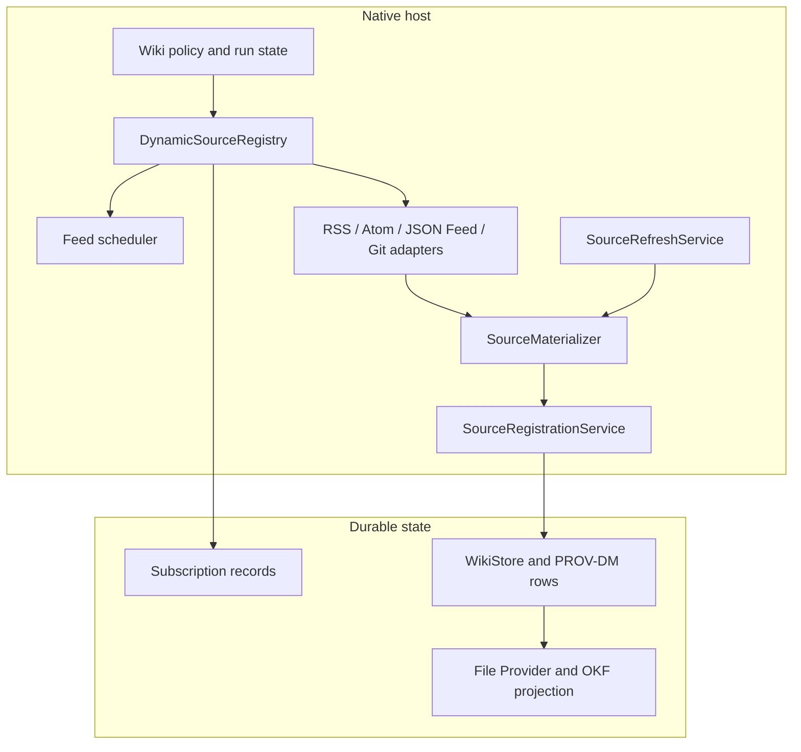

# Wiki App platform

Last revised: 2026-08-03

## 1. Goal

Add dynamic source workflows without rebuilding the host for every new source.
The first implementation keeps source acquisition native and uses the existing
`SourceProvider` / `SourceMaterializer` write seam. A typed dynamic-source
registry manages subscriptions, polling, cursors, refresh state, and source-type
adapters. Durable writes remain native so the host retains control of validation,
transactions, policy, and provenance.

This document is the design of record for the native dynamic-source platform.
Implement the phases in order and stop at a failed gate.

Dynamic rendering remains separate. Implement renderers from
[`dynamic-renderers.md`](dynamic-renderers.md) and issue #1026.

The first validation cases are:

- RSS, Atom, and JSON Feed subscriptions (#1048).
- Git repositories frozen at commit and incrementally re-read (#261; PoC PR
  #1044 and `plans/repo-tracking.md` on that branch).

## 2. Scope and sequencing

### First release

The first release supports:

- native, first-party source adapters compiled into the host.
- RSS, Atom, and JSON Feed subscriptions.
- git repository tracking and commit-pinned source material.
- user-triggered refresh and ingestion.
- scheduled feed polling with conditional HTTP requests.
- typed source proposals and multi-artifact proposals.
- atomic registration through one native service.
- immutable source and content versions with PROV-DM provenance.
- per-wiki enablement, pause, resume, retry, and diagnostics.
- CLI/API inspection and administrative operations where existing surfaces
  support them.

The first release does not support:

- third-party source packages or package distribution.
- worker-executed Python, TypeScript, or arbitrary JavaScript.
- generic shell capabilities or direct worker network access.
- host-managed credentials for native adapters.
- automatic agent ingestion of newly discovered material.
- generated Swift or dynamic native libraries.
- editable renderers, schedules for non-feed sources, webhooks, or signing.

Existing built-in paths remain available until a replacement passes its
compatibility gate. Do not remove a built-in path as foundation work.

## 3. Architectural boundary



`SourceProvider` is the typed taxonomy of source origin. `SourceMaterializer`
produces bytes, filenames, MIME types, and provenance without touching the
store. `SourceRegistrationService` is the native commit boundary. The dynamic
registry is an orchestration layer above these types; it must not duplicate
materialization or write SQLite directly.

Every adapter is treated as fallible input processing. Network responses,
feed contents, repository contents, and metadata are untrusted data even when
the adapter is built into the app. Native code validates all proposed outputs
before durable commit.

## 4. Typed model

Add Foundation-only types to `WikiFSTypes` or the Foundation-only part of
`WikiFSCore`:

- `DynamicSourceID` identifies one subscription or tracked source.
- `DynamicSourceKind` is a closed set: `.feed` and `.gitRepository` initially.
- `DynamicSourceReference` identifies one source and its configuration version.
- `DynamicSourceRunID` identifies one poll/refresh operation.
- `DynamicSourceCursor` is a tagged cursor, not a bare string.
- `FeedEntryID` identifies a feed entry within a feed namespace.
- `GitCommitID` identifies a validated commit hash.
- `SourceOperationID` identifies one registration operation.
- `SourceOperationReference` pins an operation to its exact source/configuration.
- `DynamicSourceRunState` represents one legal run lifecycle.

Do not use bare `String` values for these namespaces. Convert raw values only at
JSON, SQLite, CLI, Git, and HTTP boundaries. Use tagged enums when one field can
hold cursors or identifiers from different source kinds. Use a finite state
machine for subscription and run lifecycles.

Suggested run states are `created`, `queued`, `starting`, `polling`,
`validating`, `committing`, `succeeded`, `unchanged`, `failed`, `cancelled`,
and `abandoned`. Define legal transitions in one pure reducer.

## 5. Dynamic source registry

`DynamicSourceRegistry` combines built-in adapter descriptors with enabled
per-wiki source records. It exposes pure queries over an immutable snapshot and
an actor-owned orchestration API for refresh operations.

A descriptor declares:

- a typed `DynamicSourceKind` and stable logical identifier.
- display name and readiness state.
- accepted configuration schema and bounded input limits.
- supported operations: discover, refresh, or materialize.
- cursor and deduplication policy.
- credential behavior and allowed network behavior.
- output source/artifact kinds.
- adapter and protocol version.

The registry resolves an adapter by explicit kind and stable priority. Registry
registration order must not change behavior. A queued run pins the exact
adapter/protocol version, configuration hash, input cursor, and effective policy.
Registry changes do not replace an active run.

Adapters implement a protocol shaped like:

```swift
protocol DynamicSourceAdapter: Sendable {
    associatedtype Configuration: Sendable
    associatedtype Cursor: Sendable

    var descriptor: DynamicSourceDescriptor { get }
    func poll(
        configuration: Configuration,
        cursor: Cursor?,
        context: DynamicSourceContext
    ) async throws -> DynamicSourcePollResult
}
```

The registry boundary uses non-generic, Codable tagged values:
`DynamicSourceConfiguration` and `DynamicSourceCursor` are enums with `.feed`
and `.gitRepository` cases. Each case owns its validation and decoding rules;
adapter internals may use strongly typed representations after decoding.
Heterogeneous adapters are held through a concrete erased wrapper:

```swift
struct AnyDynamicSourceAdapter: Sendable {
    let descriptor: DynamicSourceDescriptor
    func poll(
        configuration: DynamicSourceConfiguration,
        cursor: DynamicSourceCursor?,
        context: DynamicSourceContext
    ) async throws -> DynamicSourcePollResult
}
```

The wrapper rejects mismatched enum cases with a typed error before invoking its
implementation. Persist `adapterProtocolVersion`, `configurationSchemaVersion`,
and `cursorSchemaVersion` separately. A descriptor declares explicit supported
closed ranges for each version; compatibility means the pinned versions are in
those ranges. Compatible payloads decode directly. An unsupported payload must
use a named pure migration before execution, or enter typed `upgradeRequired`
state. There is no informal semantic-version inference. Queued runs pin the
adapter ID, input/configuration hashes, cursor, and policy snapshot. Adapter
code returns staged proposals; it does not write the store.

## 6. Feed subscriptions

The feed adapter supports RSS 2.0, Atom, and JSON Feed. Add Source validates the
URL and performs a bounded initial fetch and parse before creating a subscription.
The subscription stores:

- `DynamicSourceID`, feed URL, display name, and feed format.
- enabled/paused state and polling interval.
- validator state (`ETag`, `Last-Modified`) and last response metadata.
- typed entry cursor and last successful poll time.
- configuration and adapter version hashes.
- last error, retry metadata, and next eligible poll time.

The initial-import policy is explicit and persisted. The first release defaults
to the latest bounded number of entries, with an optional date cutoff. The UI
must tell the user what will be imported before commit.

For each entry, preserve title, author, publication date, permalink, feed
identity, and stable entry identity as typed package-supplied claims. Fetching an
entry URL is a separate bounded operation; the feed itself may be stored as a
source or artifact when the user chooses that policy. The default creates URL
source proposals and records the feed relationship in provenance/claims.

Deduplicate by stable feed identifier within the feed when present, then by
canonical entry URL. The idempotency key includes wiki, subscription,
configuration hash, entry identity, and source operation request key. A later
poll must import an entry exactly once after restart or retry.

Scheduled polling is allowed only for feed discovery. It performs conditional
requests and does not start an agent run or spend model budget. New entries are
visible as pending source proposals. User action starts materialization and
registration, subject to the existing ingest/generation policy. Polling has
bounded response size, entry count, concurrency, timeout, and retry limits.

The scheduler is app-scoped and runs only while the app process is active in
this release. The app lifecycle owner starts it after store selection and stops
it during termination or safe mode. On launch, wake, or network restoration,
overdue enabled feeds become eligible once; missed intervals coalesce rather
than replay. Only one run per subscription may be active. The persisted
`nextEligiblePollAt`, `lastPollStartedAt`, and backoff fields make this behavior
restart-safe. The clock, lifecycle notifications, and network-status provider
are injected in tests.

The scheduler is serialized through a named policy and pauses when safe mode or
the app's network policy requires it. It must not block edits, queries, or
unrelated ingestion. Failed polls remain visible and retry with bounded
backoff; malformed individual entries are reported without silently dropping the
valid entries. True polling while the app is terminated is explicitly deferred;
it would require separate macOS background execution infrastructure.

## 7. Git repository adapter

Generalize the repository-tracking PoC rather than creating a second persistence
model. A tracked repository stores its remote URL, branch, checkout identity,
head commit, last-ingested commit, fetch metadata, and configuration version.
The gap between head and last-ingested commit is pending work.

The app writes the observed head. Only a successful ingestion operation advances
the last-ingested watermark. An interrupted run leaves the watermark unchanged,
so the next run safely re-covers the range. Force-pushes are detected with an
ancestor check and fall back to a full bounded re-read.

Use the PoC's pure components as registry components:

- `GitRemoteURL` validates and normalizes accepted remotes.
- `GitCommandPlan` constructs every allowed Git argv.
- `RepoCheckoutLocation` prevents checkout-path collisions.
- `RepoSyncPlan` determines initial, incremental, unchanged, and force-push
  cases.
- `RepoStateSnapshot` records the materialized commit state.
- `GitRunner` owns process execution, pipe draining, credential fail-fast, and
  process-group cancellation.

Checkouts are read-only inputs. The adapter must reject mutating Git commands
and must not let the agent write into a checkout. Provenance includes repository,
commit, path, and line range where applicable. Git tracking is user-triggered in
this release; automatic fetch polling is a later policy decision because it can
create expensive re-ingestion pressure.

## 8. Source registration and atomic commit

Add one typed `SourceRegistrationService`. Native adapters, refresh flows, and
future `wikictl source add` must call this service. Do not expose the private
`WikiStoreModel.storeMaterialized` seam as the long-term public integration API;
wrap it first, then migrate callers without changing output.

The service accepts a complete staged proposal and validates it before starting
a transaction:

- filenames, paths, MIME types, sizes, and hashes.
- source kind, canonical external identity, and deduplication keys.
- feed claims, repository claims, and provenance references.
- every artifact and relationship in a multi-artifact proposal.
- source-operation idempotency key and pinned adapter/configuration version.

It then calls one new typed, method-atomic store operation, for example
`registerSourceProposal(_:) throws -> SourceRegistrationResult`. This is a
`WikiStore` protocol requirement, not a transaction closure exposed to callers.
The service performs complete structural, size, hash, and bounded-input
validation before invoking the store. The store operation revalidates all
persistence-dependent invariants, including current subscription state, stale
cursor/watermark checks, deduplication, and idempotency, inside its private
transaction. It writes, inside the concrete store's existing lock/savepoint
machinery:

- source and content versions.
- processed Markdown and supported artifacts.
- provenance agents, activities, inputs, claims, and output links.
- source-operation idempotency row and recorded result.
- subscription cursor/watermark changes that are part of the same import.

`GRDBWikiStore` implements the complete operation in one `mutate(event:)` body
using its internal database handle. No database connection, statement, closure,
or transaction state crosses the method boundary. The operation emits exactly
one post-commit `ResourceChangeEvent` at depth zero. In-memory and fixture store
implementations conform to the same typed method.

Do not run network, inference, Git, or adapter code inside the store operation.
The idempotency key includes the exact source configuration, run ID, and request
key. If the row exists, return its recorded result. If it does not exist, the
commit did not happen and retry is safe. Failure injection after each write stage
must roll back every row and emit no change event.

Persist run intent before adapter execution. If cancellation races with commit,
read the idempotency row and report the result. Every new public store mutation
must use the existing `mutate(event:_:)` change signal or carry an explicit
no-emit reason.

Build this service from `SourceMaterializer.swift`, `MaterializedSource`,
`SourceProvenance`, `WikiStore.swift`, `GRDBWikiStore.swift`, and the existing
`WikiStoreModel.storeMaterialized` implementation. Treat `storeMaterialized` as
a compatibility adapter during migration; it is not the atomic multi-artifact
contract. Preserve the single-writer rule: materialization may run off-main;
store writes remain on the model/store write actor.

## 9. Provenance and artifacts

Use the existing PROV-DM model:

- a native adapter is a `ProvenanceAgent` with a stable provider name and
  adapter version.
- each poll, refresh, or import is a `ProvenanceActivity`.
- produced versions use `wasGeneratedBy`.
- version chains use `wasDerivedFrom`.
- add `activity_inputs` for exact input entity versions and content hashes.

Host-attested facts include requested URLs, normalized URLs, response hashes,
retrieval times, repository commit hashes, adapter versions, configuration hash,
run ID, and exact input versions. External titles, authors, timestamps,
permalinks, feed IDs, and repository metadata remain typed claims attributed to
the adapter; do not promote them to host facts.

`DynamicSourceKind` and `SourceProvider` are separate namespaces. Feed
subscription discovery uses a stable `feed` adapter agent name; it must not reuse
`SourceProvider.podcast`, which is reserved for the existing podcast-transcript
path. No `SourceProvider.feed` case is added in this release. A feed entry
materialized as a URL uses the existing `website` `WebsiteMaterializer` agent
for the fetched URL and links the feed-discovery activity as an exact
input/provenance relation.

Git discovery and materialization use the stable `SourceProvider.gitRepository`
case with raw value `git-repository`. Its display label is “Git repository” and
its external identity is repository, commit, and path. It must not be conflated
with `website`. Add exhaustive display/capability tests for the new case and
raw-value compatibility tests for every existing `SourceProvider` case.

The initial artifact vocabulary includes processed Markdown, source proposals,
source revision proposals, files/blobs, feed snapshots, and namespaced JSON
feed metadata. Add typed artifacts only when a consumer needs them. PROV-DM rows
remain the source of truth; File Provider and OKF projections remain derived.

## 10. Existing refresh and extraction integration

Keep `SourceRefreshService` for refresh-by-provenance of an already registered
source. Dynamic-source polling is different: it discovers new material and
advances a subscription cursor. Both paths may construct a
`SourceMaterializer`, and both must commit through `SourceRegistrationService`.
Do not add dynamic-source branches to every UI or store call site.

Extraction remains a separate stage. A feed poll or Git discovery can register
source material without extracting it; extraction can append an alternative
Markdown or artifact version without overwriting prior output. Existing built-in
extractors continue to use the `GenerationGate` ingest lane and must not block
unrelated queries, edits, or another source run.

Agent ingestion is a third stage. It pins source and artifact versions before
execution. A later feed poll, Git fetch, or extraction cannot change active
inputs. Registration, extraction, and ingestion each have their own run,
result, and provenance activity, and partial success remains durable and
retryable.

## 11. Persistence and lifecycle

Add wiki-scoped tables for dynamic source records, feed poll state, staged source
proposals, and source-operation idempotency. Use the existing migration ladder
in `GRDBWikiStore.swift` and the current schema version; do not let an adapter
create tables or run schema migrations.

Machine-scoped operational data such as checkout paths and native adapter caches
must remain outside wiki content storage. Wiki-scoped configuration, cursors,
grants, and source relationships belong in the wiki database.

Subscription states are `disabled`, `enabled`, `paused`, `polling`, `error`,
and `removed`. Disabling stops new work and preserves imported sources and
provenance. Removing a subscription removes its subscription state and pending
proposals but does not delete already imported source content. Define transitions
in one pure reducer.

## 12. Deferred worker/package platform

The untrusted-package platform remains a future extension, not a prerequisite for
native RSS or Git adapters. When third-party packages become a goal, add a
default-deny worker host and retain the same `SourceRegistrationService` as the
only durable write path.

The deferred worker gate must prove, on a real dev-signed build:

- no direct worker network syscall succeeds.
- reads and writes stay within runtime, run workspace, and package data paths.
- child and grandchild processes inherit confinement.
- cancellation terminates the full process group.
- missing sandbox configuration fails closed.
- the worker coexists with the current `wikid` XPC service.

The future package contract may include immutable package versions, normalized
manifests, lockfiles, content hashes, native-extension denial by default, typed
capabilities, per-wiki grants, package state, and brokered network access. The
future worker must submit staged proposals to the native registration service;
it must not receive a private store handle or generic shell capability.

Deferred future phases are:

1. worker confinement and process-group gate.
2. package validation, typed capabilities, lifecycle, and registration API.
3. network broker, package-owned state, OAuth relay, and one validation package.
4. agent capability catalog and pinned authoring descriptors.
5. package installation, enablement, diagnostics, rollback, and removal UI.

These phases have no authority to delay or reorder the native dynamic-source
phases below.

## 13. Implementation phases

### Phase 0: Native contracts and compatibility characterization

Add typed dynamic-source identifiers, descriptor and run-state reducers, adapter
protocols, registry snapshots, and characterization tests around
`SourceProvider`, `SourceMaterializer`, `SourceRefreshService`, and
`WikiStoreModel.storeMaterialized`. Define the migration and idempotency
contracts before adding adapters.

Gate: existing source registration, refresh, extraction, provenance, and store
emission tests remain green; `make build` passes.

### Phase 1: SourceRegistrationService

Implement staged proposals, validation, one-transaction commit, idempotency,
crash-point recovery, multi-artifact support, and PROV-DM activity inputs. Route
one existing native source path through the service without changing output.

Primary files:

- `Sources/WikiFSTypes/`.
- `Sources/WikiFSCore/Sources/SourceMaterializer.swift`.
- `Sources/WikiFSCore/Store/WikiStore.swift`.
- `Sources/WikiFSCore/Store/GRDBWikiStore.swift`.
- `Sources/WikiFSCore/Store/WikiStoreModel.swift`.
- new registration and proposal files in `WikiFSCore`.

Gate: package-independent transaction, idempotency, crash recovery, provenance,
and store-emission suites pass; existing source output is byte-compatible.

### Phase 2: Native registry and feed discovery

Implement `DynamicSourceRegistry`, feed descriptor/configuration types, RSS/Atom/
JSON Feed parsing, canonicalization, stable entry identity, bounded limits,
conditional request state, and staged proposals. Add persisted subscriptions
and the explicit initial-import policy.

Gate: fixtures cover all three feed formats, malformed entries, truncation,
deduplication, validators, retry/backoff, restart recovery, and exact-once
proposal identity. No agent run starts from polling.

### Phase 3: Feed scheduler and product controls

Add app-scoped scheduled polling with configurable intervals, bounded
concurrency, pause/resume, refresh-now, diagnostics, retry, and pending-entry
review. Integrate with the existing queue/generation policy without blocking
interactive work. Add app UI and CLI/API inspection where appropriate.

Gate: scheduled polling performs no unnecessary full download when validators
work; failures are actionable; imported sources survive restart and subscription
removal; accessibility and safe-mode behavior pass.

### Phase 4: Git adapter integration

Port the PoC's pure Git components into the registry and shared run model. Add
tracked-repository persistence, read-only checkout enforcement, commit-pinned
provenance, incremental/force-push plans, process-group cancellation, and the
manual update queue.

Gate: initial, incremental, unchanged, force-push, credential failure, retry,
and interrupted-watermark cases pass. Existing repo-tracking behavior remains
compatible before any old route is removed.

### Phase 5: Extraction and ingestion integration

Route feed and Git outputs through existing extraction choices and the separate
agent-ingestion stage. Pin exact source/artifact versions and provenance inputs.
Add partial-success diagnostics and ensure extraction does not overwrite prior
alternatives.

Gate: registration can succeed while extraction or ingestion fails, each stage is
retryable, and the active ingestion input snapshot remains unchanged.

### Phase 6: Compatibility cleanup

Only after the preceding gates pass, remove duplicate native routes or private
call paths. Keep compatibility adapters where existing data or CLI behavior
requires them. Add migration coverage and complete accessibility, rollback,
removal, and safe-mode tests.

Gate: `make build` and `make test` pass, and all existing source/provider,
refresh, extraction, provenance, and File Provider compatibility suites pass.

## 14. Test strategy and acceptance criteria

Use Swift Testing for new unit and integration tests. Every acceptance criterion
must have at least one named regression test. Tests use injected clocks,
lifecycle notifications, network responses, Git runners, failure points, and
store fixtures; they must not depend on wall-clock sleeps or live feeds.

| ID | Observable acceptance criterion | Required regression coverage |
|---|---|---|
| AC.1 | RSS 2.0, Atom, and JSON Feed URLs validate and create a persisted subscription with an explicit bounded initial-import policy. | `FeedParserTests.testParsesRSSAtomAndJSONFeed`; `DynamicSourcePersistenceTests.testPersistsInitialImportPolicy` |
| AC.2 | Conditional polling sends validators, handles 304 and changed responses, and coalesces missed intervals while the app is active. | `FeedConditionalPollingIntegrationTests.testETagAndLastModifiedProduceConditionalRequest`; `FeedConditionalPollingIntegrationTests.testNotModifiedDoesNotReparse`; `FeedSchedulerTests.testLaunchCatchUpCoalescesMissedIntervals` |
| AC.3 | Stable feed IDs and canonical URLs discover each entry exactly once across retry, restart, and unchanged polls. | `FeedDeduplicationTests.testStableIDThenCanonicalURL`; `DynamicSourcePersistenceTests.testRestartReplayIsExactlyOnce` |
| AC.4 | Polling never starts agent/model ingestion without explicit user or policy action. | `FeedSchedulerTests.testPollingDoesNotEnqueueAgentIngestion` |
| AC.5 | Pause, resume, refresh-now, safe mode, network restoration, backoff, cancellation, and one-run-per-subscription behavior are deterministic. | `FeedSchedulerTests.testPauseResumeAndRefreshNow`; `FeedSchedulerTests.testSafeModeStopsAndResumeRestartsEligibility`; `FeedSchedulerTests.testNetworkRestorationRunsOneCoalescedCatchUp`; `FeedSchedulerTests.testWakeCatchUpAndOverlapPrevention`; `FeedSchedulerTests.testBackoffAndCancellation` |
| AC.6 | A complete proposal commits all source, artifact, provenance, idempotency, and cursor/watermark rows atomically and emits one post-commit event. | `SourceRegistrationServiceTests.testCommitProducesCompleteResult`; `SourceRegistrationServiceTests.testRejectsStaleCursorDuringCommit`; `SourceRegistrationCrashRecoveryTests.testRollbackAfterEachWriteStage`; `StoreEmissionTests.testRegistrationEmitsOneEvent` |
| AC.7 | Replaying an existing idempotency key returns the recorded result without duplicate content or cursor advancement. | `SourceRegistrationServiceTests.testIdempotentReplayReturnsRecordedResult`; `SourceRegistrationServiceTests.testConcurrentReplayUsesOneCommit` |
| AC.8 | Dynamic provenance distinguishes feed discovery, website materialization, and Git materialization; existing provider raw values remain compatible. | `DynamicSourceProvenanceTests.testFeedDiscoveryLinksWebsiteMaterialization`; `DynamicSourceProvenanceTests.testGitIdentityIncludesCommitAndPath`; `SourceProviderCompatibilityTests.testExistingRawValuesRemainStable`; `SourceProviderCompatibilityTests.testGitRepositoryDisplayAndCapabilities` |
| AC.9 | Git supports initial, incremental, unchanged, force-push, credential failure, read-only checkout, process cancellation, and interrupted-watermark recovery. | `GitDynamicSourceAdapterTests.testSyncPlansAndForcePush`; `GitDynamicSourceAdapterTests.testReadOnlyAndCredentialFailures`; `GitDynamicSourceAdapterTests.testCancellationTerminatesProcessGroupAndPreservesWatermark`; `GitDynamicSourceAdapterTests.testWatermarkAdvancesOnlyAfterCommit` |
| AC.10 | Registration, extraction, and ingestion can succeed or fail independently, and active ingestion inputs remain pinned. | `DynamicSourceStageRetryTests.testPartialSuccessIsRetryable`; `DynamicSourceStageRetryTests.testActiveInputsRemainPinned` |
| AC.11 | Removing a subscription removes pending subscription state but preserves imported sources, versions, and provenance. | `DynamicSourcePersistenceTests.testRemovalPreservesImportedContent` |
| AC.12 | UI controls expose status, errors, accessibility labels, safe-mode behavior, and queue serialization without blocking edits or queries. | `DynamicSourceControlsHostedTests.testControlsAndAccessibility`; `DynamicSourceControlsHostedTests.testFailureDiagnosticsAreVisible`; `DynamicSourceControlsHostedTests.testSafeModeDisablesPollingControls`; `DynamicSourceControlsHostedTests.testQueueSerialization`; `FeedSchedulerIsolationTests.testPollingDoesNotBlockStoreReadsWritesOrInteractiveIngest` |
| AC.13 | The native registry resolves deterministic, version-compatible adapters and blocks incompatible queued runs with `upgradeRequired`. | `DynamicSourceRegistryTests.testStableResolutionOrder`; `DynamicSourceRegistryTests.testMismatchedConfigurationTagFails`; `DynamicSourceRegistryTests.testSupportedVersionRangeAndMigration`; `DynamicSourceRegistryTests.testIncompatibleVersionRequiresUpgrade`; `DynamicSourceRegistryTests.testActiveRunPinsSnapshot` |
| AC.14 | Compatibility tests pass before any existing built-in route or private call path is removed. | `SourceCompatibilityTests.testLegacyIntakeOutputRemainsByteCompatibleUntilMigrationGate`; `ExtractionCompatibilityWriterTests.testLegacyExtractionRouteRemainsAvailable`; `ProjectionTests.testRegisteredDynamicSourceProjectsLikeLegacySource` |
| AC.15 | All Swift code builds and the full suite passes through the supported SwiftPM entry points. | `BuildEntryPointTests.testSwiftPMEntryPointsAreDocumented`; command gates `make build` and `make test` |

Every implementation pull request runs targeted tests during development. Run
`make build` and `make test` before the pull request is ready. All Swift code
must compile with SwiftPM; do not depend on Xcode-only APIs or schemes.

## 15. Risks, decisions, and blockers

- **App lifecycle:** first-release polling runs only while the app is active;
  launch/wake/network restoration performs one coalesced catch-up. Terminated-app
  background polling is deferred and requires a separate macOS execution design.
- **Feed identity:** publishers may change IDs or URLs. The adapter records both
  stable IDs and canonical URLs, preserves claims, and surfaces identity changes
  instead of silently merging unrelated entries.
- **HTTP caching:** validators are advisory. A 200 response is hashed and parsed;
  a 304 cannot advance the entry cursor. Redirects and response limits remain
  host policy decisions.
- **Git force-pushes:** ancestor failure triggers a bounded full re-read and
  explicit diagnostic; it never advances the watermark speculatively.
- **Store atomicity:** the new typed method-atomic store operation is a required
  foundation change. Do not implement a closure-based public transaction or
  treat current non-atomic `storeMaterialized` behavior as sufficient.
- **Change events:** registration emits one event after commit. Tests must cover
  nested savepoints, rollback, and no event on failure.
- **Migration:** new tables and migrations must be reversible in fixtures and
  preserve existing source/provider raw values. Adapter code cannot migrate the
  schema.
- **Credentials:** native RSS uses no credentials in the first release. Git
  uses existing host credential helpers/`gh` behavior from the PoC and never
  stores credentials in wiki content.
- **Scope decisions:** Slack, Tavily, archives, package-owned credentials,
  true terminated-app schedules, and worker execution are future efforts. Do
  not leave “where appropriate” implementation decisions unresolved at handoff;
  each new surface must be named in the phase task or explicitly deferred.

## 16. Review strategy

Before handoff, review the plan against the actual store protocol, migration
ladder, `SourceMaterializer`, `SourceRefreshService`, app lifecycle, and PoC
components. During implementation, each phase stops at its gate. After code and
tests pass, run an independent plan/code review with a heterogeneous model or
reviewer. Classify findings as critical/high/medium/low; fix or explicitly rebut
all critical and high findings, then rerun the review. Do not mark a phase
complete based only on prose or generic `make test` output.

## 17. Documentation strategy

Keep `PLAN.md` as the index for this feature and add specific design details in
`plans/` rather than expanding unrelated plans. Record phase progress and gate
results in `progress/` using the repository's Simplified Technical English
style. Update architecture documentation with the registry, registration
service, schema, provenance, and scheduler ownership. Add user-facing
instructions for feed subscription management, pending-entry review, Git
tracking, pause/resume, retries, and removal semantics. Update CLI/API help and
migration notes when those surfaces ship. Run `make prompts` only if prompt
files change.

## 18. Completion criteria

The native platform is complete when AC.1 through AC.15 pass, all phase gates
pass, and the Review Strategy has no unresolved critical or high findings. The
deferred worker/package platform is complete only after its separate signed
worker gate and package-security gates pass; it is not required for this native
release.

## 19. Related work

- [Dynamic renderers](dynamic-renderers.md), issue #1026.
- RSS/Atom/JSON Feed subscriptions, issue #1048.
- New source providers, issue #261.
- Repository tracking PoC, PR #1044.
- `wikictl source add`, issue #390.
- extraction framework, issue #799.
- OKF v0.2, issue #927.
