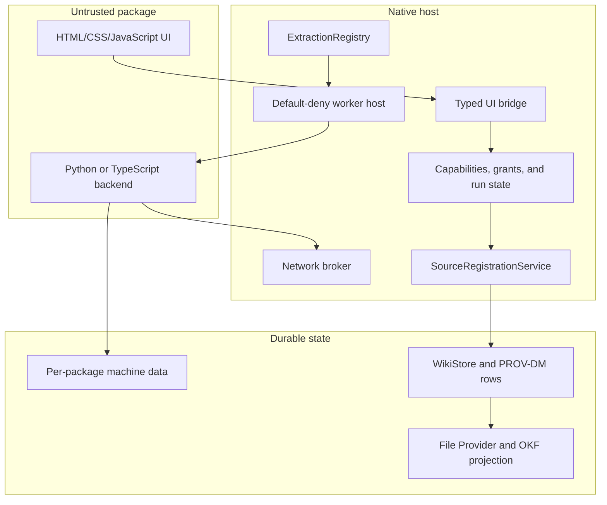

# Wiki App platform

Last revised: 2026-08-01

## 1. Goal

Add worker-based source workflows and extractors without rebuilding the host.
Native Swift keeps control of durable writes, policy, provenance, and user
state.

This document is the design of record. Implement this plan directly. Do not
look for a versioned plan or a review document.

Dynamic rendering has a separate execution model. Implement renderers from
[`dynamic-renderers.md`](dynamic-renderers.md) and issue #1026.

## 2. First release

The first release supports:

- local, agent-authored packages.
- HTML, CSS, and JavaScript application interfaces.
- optional Python backends through bundled `uv`.
- optional TypeScript backends through bundled `bun`.
- user-triggered source workflows.
- user-triggered extraction.
- typed source and artifact proposals.
- per-machine package installation.
- per-wiki enablement.
- immutable package versions.
- native capability grants and provenance.

The first release does not support:

- generated Swift or dynamic native libraries.
- a generic shell capability.
- direct worker network access.
- host-managed credentials.
- schedules, webhooks, or automatic synchronization.
- editable renderers.
- third-party distribution or signing.
- application-owned SQLite schema migrations.

Current built-in paths remain available until their replacement passes the
listed compatibility gate. Do not remove a built-in path as part of foundation
work.

## 3. System boundary

Treat every package as attacker-authored. An ingested source can influence the
agent that creates the package. Human review is useful, but runtime containment
is the security control.

The host exposes closed capabilities. A package cannot derive authority from a
manifest string, a document link, or another feature in the package.

## 4. Typed model

Add these Foundation-only types to `WikiFSTypes` or the Foundation-only part of
`WikiFSCore`:

- `WikiAppID` identifies one stable package.
- `WikiAppVersion` identifies one immutable version.
- `WikiAppRunID` identifies one execution.
- `WikiAppManifestHash` binds the manifest, code, assets, and locks.
- `SourceOperationID` identifies one source operation.
- `SourceOperationReference` pins an operation to an exact package version.
- `ExtractorID` identifies one extractor registration.
- `ExtractorReference` pins an extractor to an exact package version.
- `WikiAppCapability` identifies one closed host operation.
- `WikiAppRunState` represents one legal run lifecycle state.

Do not use bare `String` values for these namespaces. Convert raw values only at
JSON, SQLite, command, and external-format boundaries.

Use tagged enums when one field can hold identifiers from different namespaces.
Use a finite state machine for package and run lifecycles.

## 5. Package contract

Each package contains:

- one normalized `wikiapp.json` manifest.
- immutable UI and backend files.
- a `uv.lock` or `bun.lock` file when a backend exists.
- exact content hashes for all package files.
- one or more source-operation or extractor registrations.

The manifest declares:

- package identity and version.
- supported host and protocol ranges.
- UI and backend entry points.
- the runtime and required runtime version.
- requested capabilities.
- non-wildcard allowed network hosts.
- input, output, time, process, and storage limits.
- source operations and extractors.

The host resolves dependencies during approval. It records the resolved lockfile
and scans the dependency tree for native extensions.

Native extensions are denied by default. A package needs an explicit approval
for each accepted native extension.

Reject symlinks, hard links, special files, duplicate archive entries, path
traversal, unsafe name collisions, and archive bombs.

Any change to the manifest, code, assets, or lockfile creates a new immutable
version and manifest hash.

## 6. Capability and grant contract

The host derives the wiki, package, manifest, run, and effective grant. Package
code cannot supply these values.

Initial worker capabilities are:

- `input.read` reads one authorized source or artifact version.
- `workspace.read` reads one run workspace object.
- `workspace.write` writes one staged run workspace object.
- `network.fetch` requests a brokered network operation.
- `artifact.propose` proposes processed Markdown or a typed artifact.
- `source.propose` proposes one or more sources or content versions.
- `state.read` reads the package namespace.
- `state.write` writes the package namespace.

The host installs only handlers for effective capabilities. Unknown operations
fail closed.

Grant evaluation has three stages:

1. Installation validates the package and requested capabilities.
2. Per-wiki enablement records eligible persistent grants.
3. Each run derives effective grants from context and policy.

A changed manifest hash does not inherit grants. The UI can show a semantic
permission difference and request a new grant.

Background approval is out of scope. A run that lacks authority returns a typed
`grantRequired` result.

## 7. Worker gate

No worker-based production route can change until this gate passes on a real
dev-signed build.

The worker must prove:

- no direct network syscall succeeds.
- reads stay inside the runtime, run workspace, and package data directory.
- writes stay inside the run workspace and package data directory.
- child and grandchild processes inherit confinement.
- cancellation terminates the full process group.
- a missing sandbox configuration fails closed.
- the worker can coexist with the current `wikid` XPC service.

The spike chooses a separate XPC service, a child-applied profile, or another
mechanism that meets every condition. Record the chosen mechanism in this plan
after the spike.

Keep the gate tests as permanent regression tests. Run them against the
dev-signed configuration, not only a debug command-line process.

### Runtime rules

`uv` packages pin one exact standalone CPython build. Side-by-side Python
installations let packages keep different versions.

The host ships one `bun` binary. A host upgrade that changes `bun` suspends all
`bun` packages until the host resolves and validates them again.

Every approved version records its exact runtime. A normal run cannot install
packages, invoke `uvx` or `bunx`, or change its environment.

Use `Sources/WikiFSCore/Core/HelpersLocation.swift` for bundled executable
resolution patterns. Use `AsyncProcessRunner.swift` only as a launch reference.
It does not provide process-group ownership today.

## 8. Source registration and atomic commit

Add one typed `SourceRegistrationService`. The future Wiki App host and
`wikictl source add` must call this service.

The service accepts a complete staged proposal. It validates filenames, MIME
types, sizes, hashes, provenance claims, and every artifact before it starts a
transaction.

The service then calls one public store operation. That operation writes:

- source and content versions.
- processed Markdown and supported artifacts.
- provenance agents, activities, inputs, and output links.
- app-supplied claims.
- one idempotency row and recorded result.

Write all rows in one `WikiStore.withTransaction` call. Do not run inference,
network requests, or worker code inside the transaction.

The idempotency key contains the exact package version, run ID, and request key.
It has two observable states:

- The row exists. Return the recorded result.
- The row does not exist. The commit did not happen, so a retry is safe.

Persist run intent before worker execution. If cancellation races with commit,
read the idempotency row to report the result.

Build the service from `SourceMaterializer.swift`, `MaterializedSource`,
`SourceProvenance`, `WikiStore.swift`, and `GRDBWikiStore.swift`. Do not expose
the private `WikiStoreModel.storeMaterialized` seam.

Every new public store mutation must use the existing `mutate(event:_:)` change
signal or include an explicit no-emit reason.

## 9. Provenance and artifacts

Use the existing PROV-DM storage model:

- A package version is a `ProvenanceAgent` with kind `wikiapp`.
- A run is a `ProvenanceActivity` associated with that agent.
- Produced versions use the existing `wasGeneratedBy` activity link.
- Version chains use the existing `wasDerivedFrom` parent link.
- A new `activity_inputs` table records the `used` relation.

Each input row stores the entity kind, exact version identifier, and content
hash. This supports multi-input and multi-artifact runs.

The host records package identity, version, manifest hash, run ID, operation,
originating chat, options hash, runtime version, and exact input versions.

The network broker records fetched URLs, response hashes, and retrieval times.
These values are host-attested facts.

A package can supply external identifiers, permalinks, authors, and timestamps.
Store them as typed claims by that package agent. Do not convert claims into
host-attested facts.

PROV-DM rows remain the source of truth. The File Provider projects OKF v0.2
metadata from those rows. Package removal does not remove content provenance.

The initial artifact vocabulary includes:

- processed Markdown.
- source proposals.
- source revision proposals.
- files and blobs.
- namespaced JSON artifacts.
- tables with a typed column schema.

Do not create a universal runtime type system. Add a typed artifact only when a
consumer needs it.

## 10. Extraction registry

`ExtractionRegistry` combines built-in descriptors with enabled package
descriptors. Native code evaluates all matchers.

Each descriptor declares:

- an exact `ExtractorReference` and a stable logical reference.
- a display name and readiness state.
- accepted MIME types and bounded content matchers.
- output artifact kinds.
- runtime, entry point, capabilities, and limits.
- network, credential, and default-option behavior.

Resolution uses explicit priority and stable tie-break rules. Installation order
cannot select an extractor.

A queued extraction pins the exact descriptor, source content version, content
hash, manifest hash, protocol version, options hash, and grants. It never changes
extractors while queued or active.

Wrap these built-ins without output changes:

- pdf2md and current PDF backends.
- Defuddle and tag-based HTML extraction.
- podcast transcription.
- YouTube transcription.

LiteParse is the first installed extractor. It must add a PDF choice without a
host rebuild.

Preserve #799 behavior. Matching or installing an extractor does not run it.
Extraction starts only after an explicit user action or policy.

Each extraction appends an alternative Markdown or artifact version. It does
not overwrite prior output.

Adapt current paths in stages:

- `Sources/WikiFSEngine/QueueExtractionProvider.swift`.
- `Sources/WikiFSEngine/ExtractionCoordinator.swift`.
- `Sources/WikiFSMarkdown/MarkdownExtractor.swift`.
- `Sources/WikiFSCore/Sources/FormatMaterializer.swift`.
- `Sources/WikiFSCore/Sources/SourceMaterializer.swift`.
- podcast and YouTube provider dispatch.

Extraction uses the existing `GenerationGate` ingest lane. Do not let extraction
lock unrelated queries, edits, or another source ingestion run.

## 11. Source workflow applications

A source workflow acquires or refreshes external material. Slack or Zotero is
the required validation case.

The package stores its credentials in its machine-scoped package data directory.
The host does not put these credentials in Keychain or inject them.

The manifest declares that the package uses credentials and lists destination
hosts. The worker sandbox prevents another package from reading the directory.

The network broker is the only network path. It validates normalized hosts,
resolved addresses, ports, redirects, TLS, request size, response size, and
timeouts.

Deny loopback, private, link-local, rebound, proxy, WebSocket, and unusual-port
traffic unless a later typed protocol permits it.

The host can provide a loopback OAuth redirect relay. The relay forwards the
callback query to the requesting run without interpreting credentials.

The source workflow stages all source and artifact proposals. It commits them
through `SourceRegistrationService` after complete validation.

Slack or Zotero must prove:

- package-owned credential setup.
- broker-constrained pagination.
- multi-artifact source proposals.
- atomic commit and retry.
- package-scoped state.
- grant and allowed-host enforcement.
- provenance from external origin to committed source.

Do not remove a built-in source route until this case passes normal use and the
full test suite.

## 12. Agent ingestion integration

Source registration, extraction, and agent ingestion remain separate stages.
Each stage has its own run, inputs, result, and provenance activity.

An ingestion run pins the source and artifact versions before execution. A
later extraction cannot change active inputs.

The host supplies an immutable `AgentCapabilityCatalog` snapshot at run start.
The snapshot contains available input artifacts and page-authoring capabilities.

A page-authoring capability is not a renderer descriptor. It tells the agent
how to create or reference a valid chart, diagram, embed, or typed artifact.

The catalog must contain:

- one typed capability reference and version.
- accepted input shapes.
- the output artifact or Markdown form.
- a host-owned authoring schema.
- the validator reference.
- an accessible fallback presentation.

The host renders typed fields into task context. Do not inject arbitrary package
prose into the trusted system prompt.

The planner and every executor use the same catalog snapshot. The ingestion run
records its snapshot hash and exact capability references in provenance.

Save-time validation must use the same implementation version as rendering.
Mermaid validation is the reference pattern.

Source registration can succeed while extraction fails. Extraction can succeed
while ingestion fails. Each successful stage remains durable and retryable.

## 13. Package state and lifecycle

Package data uses a namespaced key-value and JSON store. Namespace it by wiki,
package identity, and optional account.

The package interprets one stored state version in its code. It cannot create
SQLite tables or run host schema migrations.

Package states are:

- `installedDisabled`.
- `enabled`.
- `ready`.
- `suspended`.
- `broken`.
- `uninstalled`.

Run states are:

- `created`.
- `awaitingGrant`.
- `queued`.
- `starting`.
- `running`.
- `validatingOutput`.
- `committing`.
- `succeeded`.
- `failed`.
- `cancelled`.
- `abandoned`.

Define legal transitions in one pure reducer. Derive UI flags from the state.

Disable stops new runs and preserves package data. Uninstall removes package
data, registrations, grants, and caches.

An optional teardown operation can request provider-side cleanup before
uninstall. Failure or timeout does not block uninstall.

Produced wiki content and provenance survive disable, rollback, and uninstall.

## 14. Implementation phases

Implement the phases in order. Stop when a gate fails. Update this document with
the measured result before the next phase starts.

### Phase 0: Worker gate

Add the isolated worker, structured RPC, process-group ownership, runtime
resolution, and permanent confinement tests.

Primary files:

- `Sources/WikiFSCore/Core/HelpersLocation.swift`.
- `Sources/WikiFSCore/Core/AsyncProcessRunner.swift`.
- a new worker host target and XPC or helper entry point.
- `Tests/WikiFSTests/` worker protocol and confinement suites.

Gate: every condition in section 7 passes on a dev-signed build.

### Phase 1: Foundation and commit service

Add typed identifiers, package validation, lifecycle reducers,
`SourceRegistrationService`, idempotency, and PROV-DM input edges.

Primary files:

- `Sources/WikiFSTypes/`.
- `Sources/WikiFSCore/Sources/SourceVersioning.swift`.
- `Sources/WikiFSCore/Store/WikiStore.swift`.
- `Sources/WikiFSCore/Store/GRDBWikiStore.swift`.
- new package and source-registration files in `WikiFSCore`.

Gate: package, transaction, crash-point, provenance, and store-emission tests
pass. Existing source registration output does not change.

### Phase 2: Extraction extensions

Add `ExtractionRegistry`, built-in adapters, content-neutral jobs, LiteParse,
and queue integration.

Primary files:

- `Sources/WikiFSMarkdown/MarkdownExtractor.swift`.
- `Sources/WikiFSEngine/ExtractionCoordinator.swift`.
- `Sources/WikiFSEngine/QueueExtractionProvider.swift`.
- `Sources/WikiFSCore/Sources/FormatMaterializer.swift`.
- `Sources/WikiFS/Sources/ExtractionSettingsView.swift`.

Gate: built-in characterization tests remain byte-compatible. LiteParse adds a
working PDF option without a host rebuild.

### Phase 3: Source workflow validation

Add the network broker, package state service, OAuth relay, and one Slack or
Zotero package.

Primary files:

- new broker and package-state files in `WikiFSCore`.
- worker host network RPC.
- `Sources/WikiFS/Settings/` package settings UI.
- `SourceRegistrationService` multi-artifact integration.

Gate: the validation case passes every condition in section 11 during normal
use.

### Phase 4: Agent capability catalog

Add typed page-authoring descriptors, catalog snapshots, prompt rendering,
provenance pins, and save-time validation.

Primary files:

- new capability catalog types in `WikiFSCore`.
- `Sources/WikiFSCore/Integrations/ACPIngestPlan.swift`.
- `prompts/ingest-planner.md`.
- `prompts/ingest-executor.md`.
- page and artifact validation paths in `wikictl`.

After prompt changes, run `make prompts` and commit both prompt copies.

Gate: one table source produces a validated chart and accessible table fallback.
Planner and executor tests prove that both use one snapshot hash.

### Phase 5: Product UI and compatibility cleanup

Add package installation, enablement, grants, progress, diagnostics, rollback,
removal, and partial-success UI.

Remove a closed extractor or source route only after its replacement passes
compatibility tests and migration coverage.

Gate: safe mode, accessibility, rollback, removal, and compatibility suites
pass. `make build` and `make test` pass.

## 15. Test requirements

Add focused suites for:

- manifest and archive validation.
- capability and grant policy.
- worker protocol and confinement.
- process-tree cancellation.
- network redirects, rebinding, and quotas.
- source proposal validation.
- atomic commit crash points and idempotent recovery.
- provenance inputs, outputs, claims, and OKF projection.
- extraction registry resolution and compatibility.
- package state and lifecycle reducers.
- ingestion capability snapshots and rich artifact validation.
- partial success across registration, extraction, and ingestion.

Use Swift Testing for new unit and integration tests. Keep the worker gate tests
as signed-build operational tests when SwiftPM cannot reproduce entitlements.

Every implementation pull request runs targeted tests during development. Run
`make build` and `make test` before the pull request is ready for review.

## 16. Completion criteria

The platform is complete when:

- the worker gate passes and stays covered by regression tests.
- LiteParse registers without a host rebuild.
- one Slack or Zotero workflow survives normal use.
- all durable writes use `SourceRegistrationService` and one transaction.
- every produced version has gapless PROV-DM input and output edges.
- ingestion uses a pinned capability snapshot.
- built-in compatibility tests pass before any closed route is removed.
- package disable, rollback, and uninstall preserve wiki content.
- `make build` and `make test` pass.

## 17. Related work

- [Dynamic renderers](dynamic-renderers.md), issue #1026.
- Excalidraw issue #593.
- JSON Canvas issue #594.
- `wikictl source add` issue #390.
- source provider issue #261.
- extraction framework issue #799.
- OKF v0.2 issue #927.
